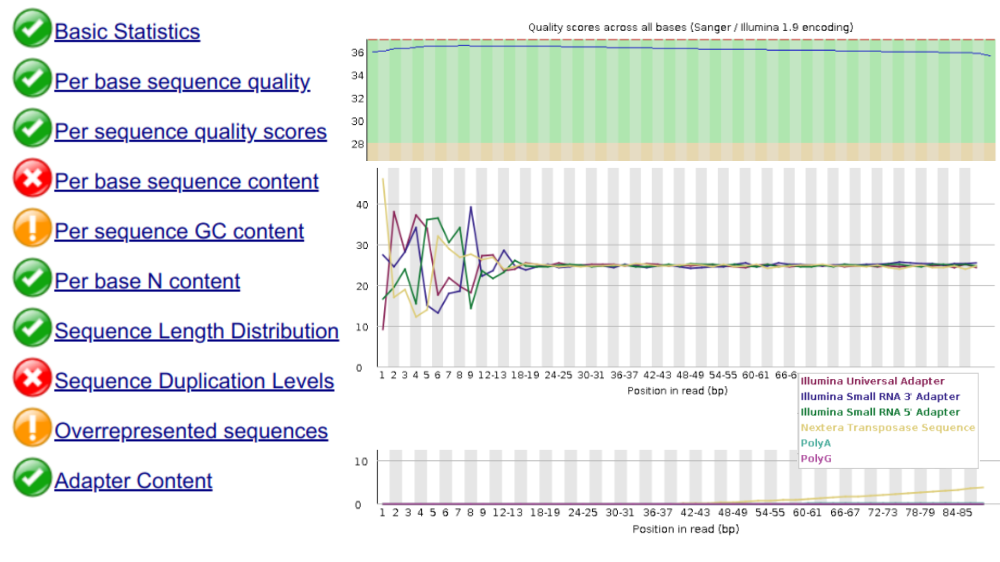
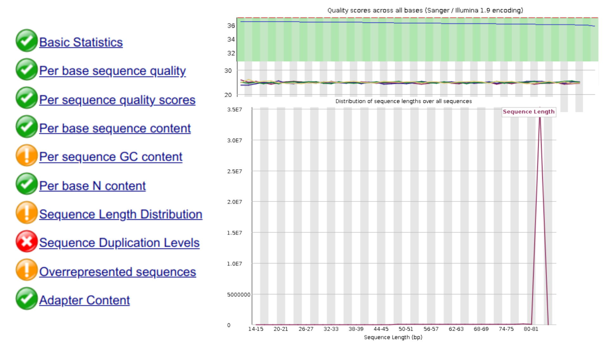

# Introducción

El alineamiento de secuencias permite la inferencia de transcritos expresados al mapear las lecturas obtenidas a partir de un experimento de RNA-seq a un genoma de referencia. En esta tarea se realizará el alineamiento de las lecturas obtenidas a partir de un experimento de RNA-seq utilizando los alineadores STAR y HISAT2, con el fin de comparar su rendimiento y calidad de alineamiento en cada uno. 

Para ello se descargaron datos de RNA-seq de la serie GSE132040, extrayendo los SRR correspondientes a muestras de riñón de ratones machos de 3 y 18 meses de edad. Luego se realizó la evaluación de calidad y limpieza de las lecturas utilizando FastQC y Trimmomatic, respectivamente, para posteriormente realizar el alineamiento utilizando ambos alineadores. Finalmente se compararon los resultados obtenidos en términos de porcentaje de lecturas alineadas y tiempo de ejecución.

# Resultados

## Descarga de datos

La descarga de los datos se realizó utilizando las herramientas `wget` para obtener los metadatos y `prefetch` junto con `fasterq-dump` para obtener los archivos `fastq` a partir de los archivos SRA. Se descargaron un **total de 7 archivos SRR** correspondientes a muestras de **riñón de ratones machos de 3 y 18 meses** de edad.

```{python}
#| eval: false
#| echo: true
#| message: false

#!/usr/bin/env python3

from datetime import datetime
import subprocess as sb
import pandas as pd
import os
import re

# Ubicando en el root del proyecto
if (pwd := os.getcwd()).split("/")[-1] == "src":
    os.chdir("..")
    print(f"Working directory changed to: {pwd}", flush=True)
else:
    print(f"Current working directory: {pwd}", flush=True)

# Descarga de datos SRA
file = "./data/GSE132040_MACA_Bulk_metadata.csv"
if not os.path.exists(file):
    print("Downloading metadata from GEO...", flush=True)
    sb.run(
        [ # Parámetros de ejecución de wget
            "wget", 
            "https://ftp.ncbi.nlm.nih.gov/geo/series/GSE132nnn/GSE132040/suppl/GSE132040_MACA_Bulk_metadata.csv", 
            "-O", 
            file
        ],
        check=True
    )

# Carga de metadatos
metadata = pd.read_csv(file)
del file

# Filtrado
patt_tissue = re.compile(r"^kidney(.?)+", re.IGNORECASE)
metadata = metadata[
    ((metadata["characteristics: age"] == "3") | (metadata["characteristics: age"] == "18")) &
    ((metadata["characteristics: sex"] == "m") & (metadata["source name"].astype(str).str.match(patt_tissue)))
]
SRR_files = list(metadata["raw file"]) # Extracción de los nombres de los archivos SRR
del pwd, patt_tissue, metadata

print(f"SRR files to download: {SRR_files}", flush=True)
print("-" * 50, flush=True)

# Generación de directorios
sra_dir = "./data/sra/"
fastq_dir = "./data/fastq/"

os.makedirs(sra_dir, exist_ok=True)
os.makedirs(fastq_dir, exist_ok=True)
os.makedirs("./tmp/", exist_ok=True)

for SRR in SRR_files:

    # Secuencias PE
    sra_file = os.path.join(sra_dir, SRR, f"{SRR}.sra")
    fastq_1 = os.path.join(fastq_dir, f"{SRR}_1.fastq")
    fastq_2 = os.path.join(fastq_dir, f"{SRR}_2.fastq")
    fastq_single = os.path.join(fastq_dir, f"{SRR}.fastq")

    # De no existir el archivo SRA, se descarga utilizando prefetch
    if not os.path.exists(sra_file):
        print(f"[{datetime.now().strftime('%d-%H:%M:%S')}] Downloading {SRR}...", flush=True)
        sb.run(["prefetch", SRR, "--output-directory", sra_dir], check=True)
    
    print(f"[{datetime.now().strftime('%d-%H:%M:%S')}] Processing {SRR}...", flush=True)

    # Obtención de los archivos fastq utilizando fasterq-dump, si no existen previamente
    if not (
        os.path.exists(fastq_single) or
        (os.path.exists(fastq_1) and os.path.exists(fastq_2))
    ):
        sb.run([
            "fasterq-dump", sra_file,
            "--split-files",
            # "--skip-technical",
            "--threads", "5",
            "--outdir", fastq_dir,
            "-t", "./tmp/"
        ], check=True)

        # Logs
        print(f"[{datetime.now().strftime('%d-%H:%M:%S')}] Finished processing {SRR}.", flush=True)
        print("-" * 50, flush=True)

print(f"[{datetime.now().strftime('%d-%H:%M:%S')}] All SRR files have been processed.", flush=True)
```

## Evaluación de calidad

Una vez obtenidos los datos en formato `fastq`, se procedió a evaluar la calidad de las lecturas con `fastqc`:

```{shell}
#| eval: false
#| echo: true

#!/usr/bin/env bash

set -euo pipefail # Si un comando falla, el script se detiene
shopt -s nullglob # Evita errores si no se encuentran archivos coincidentes

# Activando ambiente de conda para fastqc
source "$(conda info --base)/etc/profile.d/conda.sh"
conda activate multiqc

# Directorios de trabajo
DATA="./data"
FASTQ="$DATA/fastq"

mkdir -p "$FASTQ" ./logs/

# Evaluación de calidad de las lecturas utilizando fastqc en paralelo
nohup fastqc "$FASTQ"/*_1.fastq -o "${FASTQ}c_1" > ./logs/fastqc_1_explore.log 2>&1 &
nohup fastqc "$FASTQ"/*_2.fastq -o "${FASTQ}c_2" > ./logs/fastqc_2_explore.log 2>&1 &
```



Como es posible observar en la **Figura 1**, las lecturas presentan una calidad de secuenciación relativamente buena, con un porcentaje de bases por encima de *Q30* en la mayoría de los casos. Sin embargo, se observa una caída en la calidad hacia el final de las lecturas, lo cual es común en experimentos de RNA-seq. Además, se detectan adaptadores residuales de *Nextera Transpose Seq* y un sesgo de composición de bases al inicio de las lecturas (aproximadamente en las primeras 12-17 bp). Esta tendencia, ilustrada con una única muestra en la figura, se repite en las demás, lo que sugiere la necesidad de realizar una limpieza de las lecturas para mejorar la calidad de los datos antes del alineamiento.

## Limpieza de lecturas

Haciendo uso de `fastp`, se procedió a realizar la limpieza de las lecturas, eliminando los adaptadores residuales y recortando los primeros 17 bp para eliminar el sesgo de composición de bases al inicio de las lecturas. Acto seguido, se volvió a evaluar la calidad de las lecturas limpias utilizando `fastqc` para verificar la mejora en la calidad de las secuencias.

```{shell}
#| eval: false
#| echo: true

#!/usr/bin/env bash

source "$(conda info --base)/etc/profile.d/conda.sh"
conda activate fastp

# Configurando el match de patrones
set -euo pipefail
shopt -s nullglob

# Creación de carpetas
DATA="./data"
FASTQ="$DATA/fastq"
CLEAN="$DATA/fastp"
FASTQC_CLEAN_1="$DATA/fastqc_1_clean"
FASTQC_CLEAN_2="$DATA/fastqc_2_clean"
MULTIQC_DIR="$DATA/multiqc"

mkdir -p "$FASTQ" "$CLEAN" "$MULTIQC_DIR" "$FASTQC_CLEAN_1" "$FASTQC_CLEAN_2"

# Configuración de hilos y control de procesos
wks=3
threads_fastp=2
threads_fastqc=2

# Manejo de procesos en paralelo
pids=()
batch_processing() {
    if [[ ${#pids[@]} -eq $wks ]]; then
        wait "${pids[@]}"
        current_date_time="$(date "+%Y-%m-%d %H:%M:%S")"
        echo ">>>>>>>>>>>>>>>>>>>>>>>>>>>>>>>>>>>>>>>>>>>>>>>>>>>>>>>>>>>>>>>>>>>>>>>>>>>>>>>>>>>>>>>>>>>>>>>>>>>>>>>"
        echo "$current_date_time"
        echo "Lote de $wks procesos completados. Continuando con el script..."
        pids=()
    fi
}

echo "========== FASTP =========="

files=("$FASTQ"/SRR*_1.fastq)
erase_bp=17

for f in "${files[@]}"; do
    base=$(basename "$f" _1.fastq)

    # Limpieza PE por plataforma Ilumina NovaSeq
    fastp \
        -i "$FASTQ/${base}_1.fastq" \
        -I "$FASTQ/${base}_2.fastq" \
        -o "$CLEAN/${base}_clean_1.fastq" \
        -O "$CLEAN/${base}_clean_2.fastq" \
        -w "$threads_fastp" \
        --trim_poly_g \
        --trim_front1 $erase_bp \
        --trim_front2 $erase_bp \
        --detect_adapter_for_pe &

    pids+=("$!")
    batch_processing
done

# Manejo de procesos restantes
if [[ ${#pids[@]} -gt 0 ]]; then
    wait "${pids[@]}"
    pids=()
fi

echo "========== FASTQC SOBRE READS LIMPIOS =========="

conda activate multiqc

clean_files_1=("$CLEAN"/*_clean_1.fastq)

# Stats de la calidad resultante en las reads
for f1 in "${clean_files_1[@]}"; do
    base=$(basename "$f1" _clean_1.fastq)
    f2="$CLEAN/${base}_clean_2.fastq"

    fastqc \
        -o "$FASTQC_CLEAN_1" \
        -t "$threads_fastqc" \
        "$f1" &
    pids+=("$!")
    batch_processing

    if [[ -f "$f2" ]]; then
        fastqc \
            -o "$FASTQC_CLEAN_2" \
            -t "$threads_fastqc" \
            "$f2" &
        pids+=("$!")
        batch_processing
    else
        echo "Falta archivo par: $f2"
    fi
done

echo "========== MULTIQC =========="

# Comparación global de las stats antes y después de la limpieza
multiqc "$DATA" -o "$MULTIQC_DIR"

echo "Proceso terminado."
```



Tras la limpieza, el sesgo de composición de bases al inicio de las lecturas se ha eliminado, y la calidad de las secuencias ha mejorado significativamente, con un porcentaje de bases por encima de *Q30* en prácticamente toda la longitud de las lecturas. Además, los adaptadores residuales han sido eliminados, lo que se refleja en la ausencia de picos correspondientes a los adaptadores en el gráfico de calidad. Así mismo, la distribución de la longitud de lecturas ha quedado en ~83 bp, acorde a lo esperado tras el recorte de los primeros 17 bp.

# Conclusiones

[...]