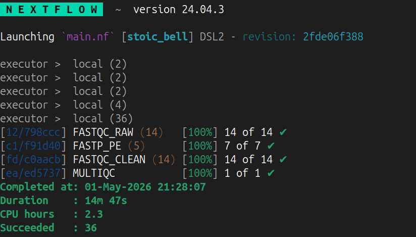
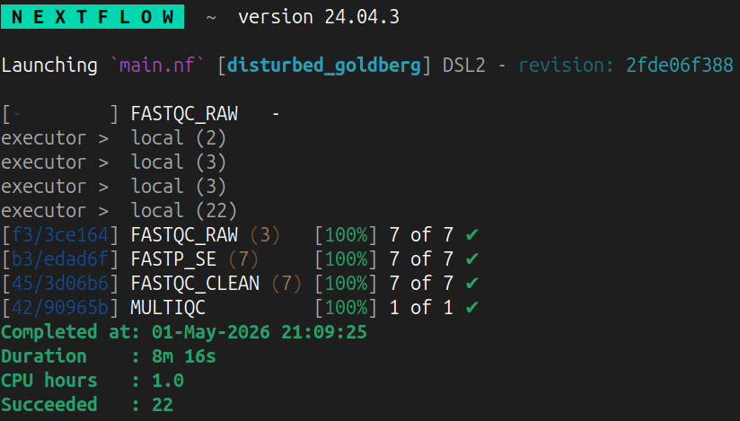
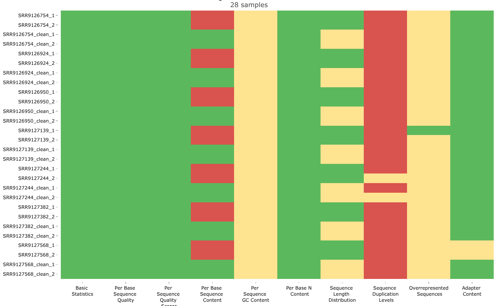
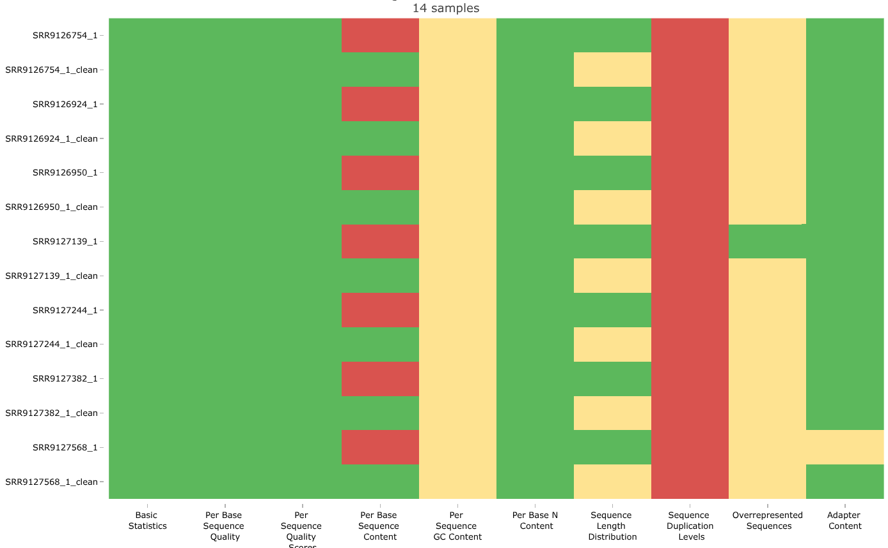

# Planteamiento

El análisis bioinformático suele requerir la integración de múltiples herramientas para la limpieza, procesamiento y análisis de datos. Si bien estos procesos se han visto facilitados por el desarrollo de software especializado, frecuentemente carecen de reproducibilidad, ya que el comportamiento de los programas y de los flujos de trabajo puede variar en función de configuraciones específicas del entorno computacional, como el hardware y las dependencias instaladas.

En este contexto, `Nextflow` surge como una solución robusta. Se trata de un *Domain Specific Language* (DSL) diseñado para la construcción de pipelines reproducibles y escalables, que simplifica la orquestación de procesos y la gestión de entornos de ejecución, incluyendo aquellos basados en `Conda`. Además, permite un control estructurado sobre las entradas y salidas de cada herramienta, favoreciendo la trazabilidad y consistencia de los análisis @ewels-2020.

# Metodología y justificación

Con el objetivo de mejorar la reproducibilidad del pipeline trabajado se desarrolló el siguiente código en `Nextflow`. Este incluye los siguientes parámetros:

- `fastq_dir` (str): directorio con los archivos `fastq`.
- `output_dir` (str): directorio de salida.
- `fastqc_tag` (str): sufijo para los archivos, se proporciona en caso de que estos lo tengan.
- `trim_front` (int): cantidad de nucleótidos a eliminar al inicio de las lecturas.
- `is_pe` (bool): indica si las lecturas deben ser tratadas como PE o SE con `true` o `false`, respectivamente.

```{groovy}
#| label: modulo_limpieza
#| echo: true
#| eval: false

#!/usr/bin/env nextflow
nextflow.enable.dsl=2

// Parámetros
params.fastq_dir = "./data/fastq"
params.output_dir = "./data/"
params.fastqc_tag = ""
params.trim_front = 15
params.is_pe = null

// ================= PROCESOS =================

// ----------------- FASTQC -----------------
process FASTQC_RAW {

  publishDir { "${params.output_dir}/${subdir}" }, mode: "copy"

  input:
  tuple path(read), val(subdir)

  output:
  path "*_fastqc.{html,zip}"

  script:
  """
  fastqc ${read}
  """
}

process FASTQC_CLEAN {

  publishDir { "${params.output_dir}/${subdir}" }, mode: "copy"

  input:
  tuple path(read), val(subdir)

  output:
  path "*_fastqc.{html,zip}"

  script:
  """
  fastqc ${read}
  """
}

// ----------------- FASTP -----------------
process FASTP_PE {

  publishDir "${params.output_dir}/fastp", mode: "copy"

  input:
  tuple val(sample), path(reads)

  output:
  tuple val(sample), path("${sample}_clean_1.fastq"), path("${sample}_clean_2.fastq")

  script:
  """
  fastp \
    -i ${reads[0]} \
    -I ${reads[1]} \
    -o ${sample}_clean_1.fastq \
    -O ${sample}_clean_2.fastq \
    -w ${task.cpus} \
    --trim_poly_g \
    --trim_front1 ${params.trim_front} \
    --trim_front2 ${params.trim_front} \
    --detect_adapter_for_pe
  """
}

process FASTP_SE {

  publishDir "${params.output_dir}/fastp", mode: "copy"

  input:
  tuple val(sample), path(read)

  output:
  tuple val(sample), path("${sample}_clean.fastq")

  script:
  """
  fastp \
    -i ${read} \
    -o ${sample}_clean.fastq \
    -w ${task.cpus} \
    --trim_poly_g \
    --trim_front1 ${params.trim_front} \
    --detect_adapter_for_se
  """
}

// ----------------- MULTIQC -----------------
process MULTIQC {

  publishDir "${params.output_dir}/multiqc", mode: "copy"

  input:
  path qc_files

  output:
  path "multiqc_report.html"
  path "multiqc_data"

  script:
  """
  multiqc . -o .
  """
}

// ================= MAIN =================
workflow {
  // Validando parámetros
  if (params.is_pe == null) {
    error "Debe indicarse si se trata de lecturas PE o SE con el parámetro --is_pe (true|false)"
  }
  if (!file(params.fastq_dir).exists()) {
    error "El directorio no existe: ${params.fastq_dir}"
  }

  is_pe = params.is_pe.toString().toBoolean()
  tag = params.fastqc_tag ?: ""

  // ----------------- PE -----------------
  if (is_pe) {

    // Captura de archivos con respecto al patrón
    reads = Channel.fromFilePairs(
      "${params.fastq_dir}/*_{1,2}.fastq*",
      checkIfExists: true
    )

    // Visualización inicial de la calidad
    // Entrada para el FASTQC_RAW
    reads_for_fastqc = reads.flatMap { sample, pair ->
      [
        tuple(pair[0], "fastqc_1${tag}"),
        tuple(pair[1], "fastqc_2${tag}")
      ]
    }

    FASTQC_RAW(reads_for_fastqc)

    // Limpieza de los archivos
    clean = FASTP_PE(reads)

    clean_for_fastqc = clean.flatMap { sample, r1, r2 ->
      [
        tuple(r1, "fastqc_1_clean"),
        tuple(r2, "fastqc_2_clean")
      ]
    }

  // ----------------- SE -----------------
  } else {
    
    // Captura de archivos y retiro de terminación para renombrado
    reads = Channel.fromPath(
      "${params.fastq_dir}/*.fastq*",
      checkIfExists: true
    ).map { read ->
      def sample = read.name.replaceAll(/\.fastq(\.gz)?$/, "")
      tuple(sample, read)
    }

    // Visualización inicial de la calidad
    reads_for_fastqc = reads.map { sample, read ->
      tuple(read, "fastqc${tag}")
    }

    FASTQC_RAW(reads_for_fastqc)

    // Limpieza de los archivos
    clean = FASTP_SE(reads)

    clean_for_fastqc = clean.map { sample, read ->
      tuple(read, "fastqc_clean")
    }
  }

  // ----------------- PARA AMBOS -----------------

  // Visualización final
  FASTQC_CLEAN(clean_for_fastqc)

  // Visualización global
  multiqc_input = FASTQC_RAW.out.mix(FASTQC_CLEAN.out).collect()
  MULTIQC(multiqc_input)
}
```

Dicho pipeline requiere de activar o crear los entornos de `Conda` pertinentes. Con dicho fin es que se ocupa el archivo `nextflow.config`, en el cual se específica tanto el entorno como la cantidad de trabajos paralelizables para cada proceso y en ambos tipos de lectura (PE o SE).



```{groovy}
#| label: configuracion
#| echo: true
#| eval: false

conda.enabled = true
conda.useMamba = false

process {

    withName: FASTQC_RAW {
        conda = "bioconda::fastqc=0.12.1"
        cpus = 2
        maxForks = 2
    }

    withName: FASTQC_CLEAN {
        conda = "bioconda::fastqc=0.12.1"
        cpus = 2
        maxForks = 2
    }

    withName: FASTP_PE {
        conda = "/export/apps/bioconda/envs/fastp"
        cpus = 2
        maxForks = 2
    }

    withName: FASTP_SE {
        conda = "/export/apps/bioconda/envs/fastp"
        cpus = 2
        maxForks = 2
    }

    withName: MULTIQC {
        conda = "/export/apps/bioconda/envs/multiqc"
        cpus = 1
        maxForks = 1
    }
}
```

Como es posible en el bloque de código anterior, no se integró la generación dinámica de los entornos virtuales para herramientas como `FASTP` y `MULTIQC` por problemas con paqueterías o programas asociados. Es por ello que se utilizaron los mismos entornos usados en la primer tarea de este curso.



A continuación se proporciona un ejemplo de uso del pipeline:

```{shell}
#| label: uso_main_nf
#| eval: false
#| echo: true

wkdir="/export/space3/users/pablosm/2026-2/Transcriptomica_clase"
temp1="tmp_pe"
temp2="tmp_se"

cd "$wkdir" && mkdir -p "$temp1" "$temp2" && clear

# Nextflow se encuentra en el entorno `base` de `Chaac`
# Esperar a que termine cada proceso

# ================= PE =================
nextflow run main.nf --fastq_dir ./data/fastq --output_dir "$temp1" --is_pe false

# ================= SE =================
nextflow run main.nf --fastq_dir ./data/fastq_se --output_dir "$temp2" --is_pe false
```

# Discusión

La necesidad de contar con pipelines bioinformáticos reproducibles es una de las premisas más relevantes de los principios FAIR @ewels-2020, de tal suerte que el desarrollo y aplicación de software para poder alcanzar ese objetivo resulta necesario. En este contexto es que `Nextflow` se posiciona como una herramienta para facilitar dicha meta, a la cual se le suma una fuerte comunidad en donde dichos pipelines son publicados para su libre acceso @ewels-2020.





El pipeline aquí desarrollado buscó adaptar el proceso a cada tipo de lectura (PE y SE). Naturalmente, el tiempo de ejecución dependió en gran medida de si las lecturas eran PE o SE, en donde el primer tipo exhibió el doble de tiempo que el segundo (ver **Figura 1** y **2**). Para cualquier caso, le ejecución se logró de forma exitosa, puesto que se obtuvo el tratamiento esperado conforme a los parámetros indicados por el usuario (ver **Figura 3** y **4**).

Ahora bien, el pipeline se vió limitado a un número de nucleótidos por retirar indicados desde que se ejecuta el comando. Esto se hizo para mantener un flujo sencillo, aprovechando lo rápido que se ejecutan los programas `FASTQC`, `FASTP` y `MULTIQC`.

# Conclusiones

En conjunto, el desarrollo de este pipeline demuestra cómo herramientas como `Nextflow` permiten estructurar análisis bioinformáticos de manera reproducible, modular y adaptable a distintos tipos de datos, en concordancia con los principios FAIR. La implementación logró integrar exitosamente etapas de control de calidad, limpieza y evaluación global para lecturas tanto PE como SE, evidenciando un comportamiento consistente y acorde a los parámetros definidos por el usuario. Si bien se optó por una estrategia simplificada en el recorte de nucleótidos para mantener eficiencia y claridad en el flujo de trabajo, el diseño del pipeline sienta las bases para futuras extensiones que incorporen mayor dinamismo en la toma de decisiones. En este sentido, más allá de los resultados obtenidos, el valor principal radica en la construcción de un flujo reproducible y escalable que puede ser fácilmente modificado, compartido y reutilizado en distintos contextos de análisis.

# Referencias