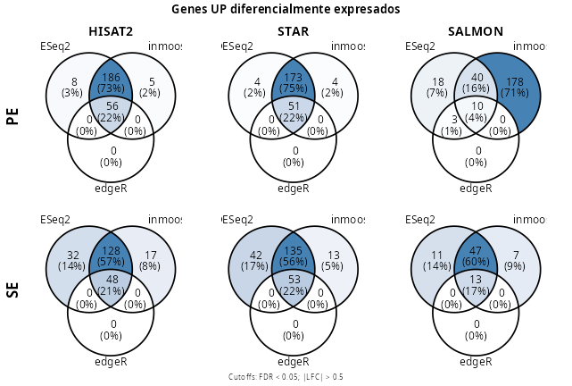
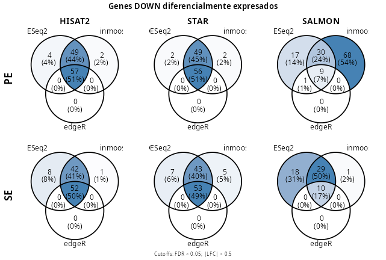

---
crossref:
  fig-title: "Figura"
  tbl-title: "Tabla"
format:
  pdf:
    pdf-engine: xelatex
    mainfont: "Arial"
    fontsize: 10pt
    toc: true
    toc-depth: 3
    number-sections: true
    include-in-header:
      text: |
        \usepackage{fvextra}
        \DefineVerbatimEnvironment{Highlighting}{Verbatim}{breaklines,commandchars=\\\{\}}
        \renewcommand{\figurename}{Figura}
    include-before-body: ./docs/entregas/cover.tex
bibliography: ./docs/referencias/Referencias_tarea-4.bib
csl: ./docs/nlm-citation-sequence-brackets.csl
---

# Planteamiento

Este trabajo compara la detección de genes diferencialmente expresados en datos de RNA-seq procesados con distintos enfoques de cuantificación: alineamiento con **HISAT2** y **STAR**, y pseudoalineamiento con **Salmon**. Para ello, evalúa tanto lecturas **paired-end (PE)** como **single-end (SE)** y aplica tres estrategias de análisis diferencial: **DESeq2 en R**, su implementación en Python mediante **inmoose**, y **edgeR**. A partir de umbrales definidos de ($FDR < 0.05$) y ($|LFC| > 0.5$), analiza la concordancia entre métodos mediante barridos de FDR, volcano plots, heatmaps y diagramas de Venn para genes sobreexpresados y subexpresados.

# Metodología & Justificación

```{python}
#| label: anotaciones
#| echo: false
#| eval: false
#| message: false

from pathlib import Path # Manejo de archivos
import pandas as pd # Parseo y guardado de archivos
import re # Expresiones regulares
import os # Manejo de rutas y archivos

# ==================== FUNCIONES ====================

def obtain_salmon_annotation(input_path: str) -> pd.DataFrame:
    if not os.path.isfile(input_path):
        raise ValueError(f"El archivo de entrada no es un archivo regular: {input_path}")
    if not os.path.isdir(outdir):
        raise ValueError(f"El archivo de entrada no es un archivo regular: {outdir}")

    # Cargando el archivo
    salmon_df = pd.read_csv(input_path, sep="\t")

    # Sólo permanecen el nombre y la longitud asociada del gen
    return salmon_df.drop(columns=["EffectiveLength", "TPM", "NumReads"])

def parse_gtf_gene_names(gtf_file: str) ->pd.DataFrame:
    gtf_file = Path(gtf_file)
    genes = []

    with open(gtf_file, "r") as f:
        for line in f:
            # Saltar comentarios
            if line.startswith("#"):
                continue

            cols = line.strip().split("\t")

            # Un GTF debe tener 9 columnas
            if len(cols) != 9:
                continue

            feature_type = cols[2]
            attributes = cols[8]

            # Sólo permanecen las filas tipo gene
            if feature_type != "gene":
                continue

            gene_id_match = re.search(r'gene_id "([^"]+)"', attributes)
            gene_name_match = re.search(r'gene_name "([^"]+)"', attributes)

            if gene_id_match and gene_name_match:
                gene_id = re.sub(r"\.\d+$", "", gene_id_match.group(1))
                gene_name = gene_name_match.group(1)

                genes.append({
                    "Geneid": gene_id,
                    "Gene_name": gene_name
                })

    geneid_genename = pd.DataFrame(genes)

    return geneid_genename

# ==================== SALMON ====================

## Rutas
pe = "./results/SALMON/PE/SRR9127568/quant.sf"
se = "./results/SALMON/SE/SRR9127568/quant.sf"
outdir = "./results/support_files"

os.makedirs(outdir, exist_ok=True)

## Obtención de las anotaciones
salmon_df = obtain_salmon_annotation(pe)
se_df = obtain_salmon_annotation(se)

## Verifica que se halla utilizado la misma anotación
assert salmon_df.equals(se_df), "Se usaron distintas anotaciones"

## Guardado del archivo
salmon_df.to_csv(
    os.path.join(outdir, "geneid-length_salmon.csv"), index=False
)

## Limpieza de variables
del se_df, pe, se, outdir, obtain_salmon_annotation

# ==================== ANOTACIÓN ====================

## Rutas
gencode_M38_annot = "./data/annotation/gencode.vM38.annotation.gtf"
outdir = "./results/support_files"

os.makedirs(outdir, exist_ok=True)

## Generación de la tabla M38_gene_id-name.csv
gene_id_name = parse_gtf_gene_names(gencode_M38_annot)
gene_id_name.to_csv(
    os.path.join(outdir, "M38_gene_id-name.csv"),
    index=False
)

## Limpieza de variables
del gencode_M38_annot, outdir, parse_gtf_gene_names
```

```{python}
#| label: anotaciones_tabla_alineadores
#| echo: false
#| eval: false
#| message: false

# =================== FUNCIONES ===================
def parse_feature_counts(
    fc_path: str, gene_length: bool = False
) -> tuple[pd.DataFrame, pd.DataFrame] | pd.DataFrame:
    if not os.path.isfile(fc_path):
        raise ValueError(f"El archivo {fc_path} no es un archivo regular.")

    # =================== LIMPIEZA DE COLUMNAS ===================
    def clean_cloumn_name(col: object) -> list[str]:
        if col == "Geneid":
            return col
        
        match = re.search(r"(SRR[0-9]+)_(age[0-9]+)", col)
        
        if match:
            return f"{match.group(2)}_{match.group(1)}"
        
        return col
    
    # Cargando tabla
    featcount_df = pd.read_csv(fc_path, sep="\t", comment="#")

    # Retirando las versiones del Geneid
    featcount_df["Geneid"] = featcount_df["Geneid"].str.replace(
        r"\.\d+$", "", regex=True
    )

    # ==================== CUENTAS ====================
    counts = featcount_df.drop(
        columns=["Chr", "Start", "End", "Strand", "Length"]
    )
    ## Cambiando el nombre de las columnas para las cuentas
    counts.columns = [
        clean_cloumn_name(col)
        for col in counts.columns
    ]

    ## Ordenando las columnas por edad
    gene_col = ["Geneid"]
    sample_cols = [col for col in counts.columns if col != "Geneid"]
    sorted_sample_cols = sorted(
        sample_cols,
        key=lambda col: int(re.search(r"age(\d+)", col).group(1))
    )

    counts = counts[gene_col + sorted_sample_cols]

    # ==================== GeneID - Length ====================
    if gene_length:
        geneid_length = featcount_df.drop(
            columns=[
                e 
                for e in featcount_df.columns 
                if e not in {"Geneid", "Length"}
            ]
        )
    
        return counts, geneid_length

    return counts

# =================== PARA C/ALINEADOR ===================
results_path = Path("./results")
pattern = re.compile(r"counts_.*_table\.txt$")

## Para todos los alineadores
support_files = Path("./results/support_files")
support_files.mkdir(exist_ok=True)

## Búsqueda de archivos
files = [
    f
    for f in results_path.rglob("*")
    if f.is_file()
    and "FeatureCounts" in f.parts
    and pattern.search(f.name)
]

## Directorios de interés
aligners_path = [
    p.parent.parent for p in files
]

## Guardado de los archivos
for i, f in enumerate(files):
    # Se genera un archivo gen-longitud para todos los
    # alineadores
    gene_length = not i

    # Archivo(s) de salida
    aligner_path = aligners_path[i]
    outfile = f"counts_table_{aligner_path.name}.csv"
    outpath = aligner_path / outfile

    # Generación de las tablas
    result = parse_feature_counts(str(f), gene_length)

    if gene_length:
        counts, gen_len_table = result
        gene_len_file = "geneid-length_aligners.csv"
        
        ## Guardado de la tabla geneid-longitud
        gen_len_table.to_csv(
            str(support_files / gene_len_file), sep=",",
            index=False
        )

        del gen_len_table, gene_len_file
    else:
        counts = result
    
    counts.to_csv(
        str(outpath), sep=",", index=False
    )

# Limpieza de variables
del result, results_path, files, aligner_path, aligners_path
del parse_feature_counts, pattern, support_files
```

## Análisis de Expresión Diferencial

En este apartado se compararon los resultados del análisis de expresión diferencial obtenidos con las herramientas `edgeR` [@chen-2025] y `DESeq2` [@anders-2010], disponibles en R mediante `Bioconductor`. Adicionalmente, se contrastó la salida de `DESeq2` con la de su implementación en Python, accesible mediante la suite `inmoose` [@colange-2025].

Es relevante destacar que se siguió el flujo de trabajo descrito en [@valle-garcia-2026] para llevar a cabo este análisis.

## Cargado de paqueterías

Se verificó que los paquetes necesarios estuvieran instalados para su uso; en caso contrario, se instalaron en el ambiente de R, como se muestra a continuación:

```{r}
#| label: paquetes_R
#| eval: false
#| echo: true
#| message: false

bioc_packages = c("DESeq2", "edgeR", "ComplexHeatmap")
cran_packages = c(
    "ggplot2", "dplyr", "tibble",
    "patchwork", "VennDiagram", "tidyr",
    "ggVennDiagram"
)

if (!requireNamespace("BiocManager", quietly = TRUE)) {
    install.packages("BiocManager")
}

for (i in 1:2) {
  if (i == 1) {
    packages = bioc_packages
  } else {
    packages = cran_packages
  }
  
  for (p in packages) {
    # Descargar en caso de que no esté disponible
    if (!requireNamespace(p, quietly = TRUE)) {
        # Elección dinámica del instalador        
        if (i == 1) {
            BiocManager::install(p, update = FALSE, ask = FALSE)
        } else {
            install.packages(p)
        }
    }
    
    invisible(library(p, character.only = TRUE))
  }
}

## Limpieza de variables
rm(bioc_packages, cran_packages, packages, i, p)
invisible(gc())
```

Para el caso de Python se ejecutó un pipeline similar dentro de un ambiente de `Conda`:

```{shell}
#| label: conda
#| echo: true
#| eval: false

conda activate mi_entorno

conda install bioconda::inmoose=0.9.1 \
              numpy=1.26.4 \
              pandas=2.2.3 \
              scikit-learn=1.7.1 \
              matplotlib=3.10.0 \
              seaborn=0.13.2 \
              scipy=1.15.2
```

Una vez hecho eso, se cargó la suite `inmoose` en el entorno adecuado:

```{python}
#| label: cargando_librerias
#| echo: true
#| eval: false
#| message: false

import matplotlib.pyplot as plt # Graficar datos
from pathlib import Path # Manejo de archivos
from inmoose.deseq2 import * # Expresión diferencial
from scipy import sparse # Manejo de objetos sparse
import seaborn as sns # Graficar datos
import pandas as pd # Manejo de tablas
import numpy as np # Operaciones vectorizadas
import gc # Recolector de basura
```

## Matriz de diseño

La matriz de diseño, también conocida como matriz modelo, establece el modelo estadístico con el que se describe la relación entre las relaciones en la expresión de los genes, _variable de respuesta_, y aquellas variables que influencian dicha expresión, _variables predictoras_ (@law-2020). En este caso se planteó a la **edad** como ***variable predictora***, con la intención de encontrar su influencia en los niveles de expresión sin contemplar otros factores como el sexo ya que todas las muetsras provienen de machos (@valle-garcia-2026).

El modelo utilizado se muestra a continuación:

$$
Y \thicksim \beta_1 + \beta_2
$$

La ausencia de un intercepto, $\beta_1 = 0$, indica que los contrastes se construyeron manualmente, ya que se buscó tener mayor control sobre las variables predictoras, $\beta_2 := \text{edad}$ utilizadas para evaluar la respuesta [@valle-garcia-2026].

## Cargado de los datos

Los datos fueron cargados en objetos únicos dentro de cada lenguaje:

### R
```{r}
#| label: cargado_R
#| eval: false
#| echo: true
#| message: false

# ================ CARGANDO DATOS ================

## PAIRED-END
pe_counts = list(
    hisat2 = read.table(
        "results/hisat2_pe/counts_table_hisat2_pe.csv",
        sep=",", row.names=1, header=TRUE
    ),
    star = read.table(
        "results/star_pe/counts_table_star_pe.csv",
        sep=",", row.names=1, header=TRUE
    ),
    salmon = read.table(
        "results/SALMON/PE/salmon_counts_pe.csv",
        sep=",", row.names=1, header=TRUE
    )
)

## SINGLE-END
se_counts = list(
    hisat2 = read.table(
        "results/hisat2_se/counts_table_hisat2_se.csv",
        sep=",", row.names=1, header=TRUE
    ),
    star = read.table(
        "results/star_se/counts_table_star_se.csv",
        sep=",", row.names=1, header=TRUE
    ),
    salmon = read.table(
        "results/SALMON/SE/salmon_counts_se.csv",
        sep=",", row.names=1, header=TRUE
    )
)

# ================ CARGANDO METADATOS ================

## Anotaciones geneid-nombre
geneid_names = read.table(
    "results/support_files/M38_gene_id-name.csv",
    sep=",", row.names = 1, header=TRUE
)

## Anotaciones geneid-length
geneid_length = list(
  hisat2 = read.table(
    "results/support_files/geneid-length_aligners.csv",
    sep=",", header=TRUE
  ), 
  star = read.table(
    "results/support_files/geneid-length_aligners.csv",
    sep=",", header=TRUE
  ), 
  salmon = read.table(
    "results/support_files/geneid-length_salmon.csv",
    sep=",", header=TRUE
  )
)
```

### Python

Se replicó el procedimiento con adaptaciones al lenguaje (como el uso de diccionarios sobre listas).

```{python}
#| label: cargado_Py
#| echo: true
#| eval: false
#| message: false

# ================ CARGANDO DATOS ================

## PAIRED-END
pe_counts = {
    "hisat2" : pd.read_csv(
        "results/hisat2_pe/counts_table_hisat2_pe.csv", 
        sep=",", header=0, index_col=0
    ),
    "star" : pd.read_csv(
        "results/star_pe/counts_table_star_pe.csv", 
        sep=",", header=0, index_col=0
    ),
    "salmon" : pd.read_csv(
        "results/SALMON/PE/salmon_counts_pe.csv",
        sep=",", header=0, index_col=0
    )
}

## SINGLE-END
se_counts = {
    "hisat2" : pd.read_csv(
        "results/hisat2_se/counts_table_hisat2_se.csv", 
        sep=",", header=0, index_col=0
    ),
    "star" : pd.read_csv(
        "results/star_se/counts_table_star_se.csv", 
        sep=",", header=0, index_col=0
    ),
    "salmon" : pd.read_csv(
        "results/SALMON/SE/salmon_counts_se.csv",
        sep=",", header=0, index_col=0
    )
}

# ================ CARGANDO METADATOS ================

## Anotaciones geneid-nombre
geneid_names = pd.read_csv(
    "results/support_files/M38_gene_id-name.csv",
    sep="," , header=0
)

## Quitando el label "Geneid"
for counts_set in (pe_counts, se_counts):
    for key, value in counts_set.items():
        value.index.name = None

## Limpieza de variables
del key, value
```

## Tablas de metadatos

Se contruyeron las tablas de metadatos para cada tabla de conteos, en las que se contienen valores utilizados más tarde para la visualización de los datos @valle-garcia-2026.

```{r}
#| label: metadata_R
#| echo: true
#| eval: false
#| message: false

# Cada tipo de alineador
count_tools = c("hisat2", "star", "salmon")

# Generación de factores comúnes
age = factor(c(rep("a3",3),rep("a18",4)), levels=c("a3","a18"))
sample_color = factor(c(rep("lightblue",3), rep("lightpink",4)))
## Mismo para todos
sample_names = colnames(pe_counts[[count_tools[1]]])

# Generación de metadata
metadata = data.frame(sample_names, age) %>%
    remove_rownames %>%
    column_to_rownames(var="sample_names")

rm(sample_names)
```

Para python se siguió un proceso similar.

```{python}
#| label: metadata_Py
#| echo: true
#| eval: false
#| message: true

from inmoose.utils import Factor

# Cada tipo de alineador
count_tools = list(pe_counts.keys())

# Generación de factores para la metadata
age = Factor(["a3"] * 3 + ["a18"] * 4)
sample_names = list(pe_counts[count_tools[0]].columns)

metadata = pd.DataFrame(
    {"age" : age}, index=sample_names
)

# Asegurando niveles explícitos
metadata["age"] = Factor(metadata["age"])
metadata["age"] = metadata["age"].cat.reorder_categories(["a3", "a18"])

# Evaluación de la consistencia en nombres
for counts_set in (pe_counts, se_counts):
    for tool, counts in counts_set.items():
        assert all(metadata.index == counts.columns), (
            f"Los nombres de las muestras no coinciden en {tool}"
        )
```

## Generación del modelo y visualización inicial

Cada implementación se ejecutó siguiendo el mismo procedimiento y con sus respectivas adaptaciones, que se desglozaron en dos secciones con una dedicada a las implementaciones de `DESeq2`.

### DESeq2

#### R

```{r}
#| label: dds_R
#| echo: true
#| eval: false
#| message: false

# ================== DIRECTORIOS ==================

results_dir_pe = list(
    hisat2 = "results/hisat2_pe/diffexp_DESeq2", 
    star = "results/star_pe/diffexp_DESeq2", 
    salmon = "results/SALMON/PE/diffexp_DESeq2" 
) 
results_dir_se = list(
    hisat2 = "results/hisat2_se/diffexp_DESeq2", 
    star = "results/star_se/diffexp_DESeq2", 
    salmon = "results/SALMON/SE/diffexp_DESeq2"
)

# ================== CARGADO DE LOS OBJETOS ==================

## PAIRED-END
pe_dds = list()
pe_vsd = list()

## SINGLE-END
se_dds = list()
se_vsd = list()

## Matriz de diseño para todas las tablas
design = model.matrix(~ 0 + age)

# Modelo para todas las tablas
for (i in 1:2) {
    if (i == 1) {
        dds = pe_dds
        counts = pe_counts
        vsd = pe_vsd
        results_dir = results_dir_pe
    } else {
        dds = se_dds
        counts = se_counts
        vsd = se_vsd
        results_dir = results_dir_se
    }

    for (tool in count_tools) {
        # Inicilización del objeto
        tmp_dds = DESeqDataSetFromMatrix(
            countData = round(counts[[tool]]),
            colData = metadata,
            design = ~ 0 + age
        )

        # Filtrado de genes con baja expresión
        keep = filterByExpr(tmp_dds, design)
        tmp_dds = tmp_dds[keep,]
        rm(keep)

        # Transformación estabilizadora de la varianza
        vsd[[tool]] = vst(tmp_dds)
        dds[[tool]] = tmp_dds

        # Guardado de la matriz VSD
        if (!dir.exists(results_dir[[tool]])) {
            dir.create(results_dir[[tool]], recursive = TRUE)
        }

        write.table(
            assay(vsd[[tool]]),
            file = file.path(
                results_dir[[tool]],
                "deseq2-vsd-matrix.csv"
            ),
            sep = ",",
            quote = FALSE,
            row.names = TRUE
        )
    }

    # Guardado final
    if (i == 1) {
        pe_dds = dds
        pe_vsd = vsd
    } else {
        se_dds = dds
        se_vsd = vsd
    }
}

# Limpieza de variables
rm(dds, vsd, tmp_dds, i, tool, counts, results_dir)
invisible(gc())
```

```{r}
#| label: "PCA para cada tipo de lectura (PE/SE) y los tres tipos de alineador (HISAT2, STAR y SALMON) tras su procesamiento en `DESeq2`."
#| echo: false
#| eval: false

# ================== FUNCIONES ==================

## Generador de PCAs
generate_pca = function(vsd_obj, title = NULL) {
    plotPCA(vsd_obj, intgroup = c("age")) +
    theme_classic(base_size = 14, base_line_size = 1) +
    labs(
      title = title,
      color = "Edad"
    ) +
    theme(
      plot.title = element_text(hjust = 0.5, face = "bold")
    )
}

# Función para crear etiquetas laterales PE / SE
row_label = function(label) {
  ggplot() +
    annotate(
      "text",
      x = 0.5,
      y = 0.5,
      label = label,
      angle = 90,
      fontface = "bold",
      size = 6
    ) +
    theme_void()
}

# ================== FIGURA ==================

## Generación de PCA por tipo de lectura
### PE
pe_pca_plots = lapply(count_tools, function(tool) {
  generate_pca(
    pe_vsd[[tool]],
    title = toupper(tool)
  )
})

### SE
se_pca_plots = lapply(count_tools, function(tool) {
  generate_pca(
    se_vsd[[tool]],
    title = NULL
  )
})

## Acomodando en dos filas de tres columnas
### PE
pe_row = wrap_plots(
  c(list(row_label("PE")), pe_pca_plots),
  nrow = 1,
  widths = c(0.08, 1, 1, 1)
)

### SE
se_row = wrap_plots(
  c(list(row_label("SE")), se_pca_plots),
  nrow = 1,
  widths = c(0.08, 1, 1, 1)
)

### Acomodo final
pca_grid = pe_row / se_row +
  plot_layout(guides = "collect") &
  theme(legend.position = "bottom")

## Ploteo
pca_grid
```


```{r}
#| label: limpieza_var_1
#| echo: false
#| eval: false
#| message: false

rm(pca_grid, pe_pca_plots, pe_row, pe_vsd)
rm(se_pca_plots, se_row, se_vsd)
invisible(gc())
```

Al no tener un factor como el sexo para generar efecto de lote, la diferencia en las varianzas (hasta este punto) parece deberse al tipo de alineador antes que al tipo de lectura (ver **Figura 1**).

Dicho eso se procedió a ajustar el modelo, encontrar los factores de normalización y de varianza:

```{r}
#| label: ajuste_modelo_DESeq2_R
#| echo: true
#| eval: false
#| message: false

for (i in 1:2) {
    if (i == 1) {
        dds_objs = pe_dds
    } else {
        dds_objs = se_dds
    }

    # Factores de normalización
    for (tool in count_tools) {
        tmp_dds = dds_objs[[tool]]
        dds_objs[[tool]] = DESeq(tmp_dds)
    }

    # Guardado final
    if (i == 1) {
        pe_dds = dds_objs
    } else {
        se_dds = dds_objs
    }

    rm(tmp_dds, dds_objs, tool, i)
    invisible(gc())
}
```

#### Python

```{python}
#| label: dds_Py
#| echo: true
#| eval: false
#| message: false

# ================== DIRECTORIOS ==================

results_dir_pe = {
    "hisat2": Path("results/hisat2_pe/diffexp_Inmoose"),
    "star": Path("results/star_pe/diffexp_Inmoose"),
    "salmon": Path("results/SALMON/PE/diffexp_Inmoose")
}
results_dir_se = {
    "hisat2": Path("results/hisat2_se/diffexp_Inmoose"),
    "star": Path("results/star_se/diffexp_Inmoose"),
    "salmon": Path("results/SALMON/SE/diffexp_Inmoose")
}

# ================== CARGADO DE LOS OBJETOS ==================

## PAIRED-END
pe_dds = {}
pe_vsd = {}

## SINGLE-END
se_dds = {}
se_vsd = {}

## Modelo para todas las tablas
for read_type in ("PE", "SE"):
    if read_type == "PE":
        dds_objs = pe_dds
        counts_set = pe_counts
        vsd_objs = pe_vsd
        results_dir = results_dir_pe
    else:
        dds_objs = se_dds
        counts_set = se_counts
        vsd_objs = se_vsd
        results_dir = results_dir_se

    for tool in count_tools:
        # Matriz de conteos
        counts = counts_set[tool].round().astype(int)

        # Metadata en el mismo orden que las columnas de los conteos
        metadata_tmp = metadata.loc[counts.columns].copy()

        # Inicialización de los objetos
        tmp_dds = DESeqDataSet(
            countData=counts.T, # muestras x genes
            clinicalData=metadata_tmp,
            design="~ age"
        )

        # Filtrado de genes con baja expresión
        # Al no haber FilterByExpr() se hará bajo un criterio arbitrario
        keep = tmp_dds.counts().sum(axis=0) >= 10
        tmp_dds = tmp_dds[:, keep]
        del keep

        # Transformación estabilizadora de la varianza
        tmp_vsd = varianceStabilizingTransformation(tmp_dds)

        # Guardado de resultados
        vsd_objs[tool] = tmp_vsd
        dds_objs[tool] = tmp_dds

        # Guardado de la matriz VSD
        results_dir[tool].mkdir(parents=True, exist_ok=True)

        # Extraer matriz VSD
        vsd_values = tmp_vsd.X

        # Por si fuera matriz sparse
        if sparse.issparse(vsd_values):
            vsd_values = vsd_values.toarray()

        # Construir DataFrame: muestras x genes
        vsd_df = pd.DataFrame(
            vsd_values,
            index=tmp_vsd.obs_names,
            columns=tmp_vsd.var_names
        )

        # Guardar como genes x muestras, equivalente a assay(vsd) en R
        vsd_df.T.to_csv(
            results_dir[tool] / "inmoose-vsd-matrix.csv",
            index_label="Geneid"
        )
    
    # Guardado final
    if read_type == "PE":
        pe_dds = dds_objs
        pe_vsd = vsd_objs
    else:
        se_dds = dds_objs
        se_vsd = vsd_objs
    
    del tmp_vsd, tmp_dds, tool, counts_set, results_dir

del read_type, dds_objs, vsd_objs
gc.collect()
```

```{python}
#| label: "PCA para cada tipo de lectura (PE/SE) y los tres tipos de alineador (HISAT2, STAR y SALMON) tras su procesamiento en `DESeq2` en Python."
#| fig-width: 12
#| fig-height: 6
#| echo: false
#| eval: false

from sklearn.decomposition import PCA

# =================== FUNCIONES ===================

def plot_pca_vsd(vsd_obj, ax, title=None, hue="age", palette=None):

    X = vsd_obj.X

    if hasattr(X, "toarray"):
        X = X.toarray()

    X = np.asarray(X)

    pca = PCA(n_components=2)
    coords = pca.fit_transform(X)

    var_exp = pca.explained_variance_ratio_ * 100

    pca_df = pd.DataFrame(
        {
            "PC1": coords[:, 0],
            "PC2": coords[:, 1],
            hue: vsd_obj.obs[hue].values
        },
        index=vsd_obj.obs_names
    )

    sns.scatterplot(
        data=pca_df,
        x="PC1",
        y="PC2",
        hue=hue,
        palette=palette,
        ax=ax,
        s=70
    )

    ax.set_xlabel(f"PC1: {var_exp[0]:.0f}% variance")
    ax.set_ylabel(f"PC2: {var_exp[1]:.0f}% variance")

    if title is not None:
        ax.set_title(title, fontweight="bold")

    legend = ax.get_legend()
    if legend is not None:
        legend.remove()

    sns.despine(ax=ax)

    return ax

# =================== GRAFICADO ===================
palette = {
    "a3": "#F8766D",
    "a18": "#00BFC4"
}

## Evita empalme con plots previos
plt.close("all")

fig, axes = plt.subplots(
    nrows=2,
    ncols=len(count_tools),
    figsize=(12, 6)
)

for j, tool in enumerate(count_tools):
    plot_pca_vsd(
        pe_vsd[tool],
        ax=axes[0, j],
        title=tool.upper(),
        hue="age",
        palette=palette
    )

for j, tool in enumerate(count_tools):
    plot_pca_vsd(
        se_vsd[tool],
        ax=axes[1, j],
        title=None,
        hue="age",
        palette=palette
    )

fig.text(0.02, 0.70, "PE", va="center", ha="center",
         rotation=90, fontsize=14, fontweight="bold")

fig.text(0.02, 0.30, "SE", va="center", ha="center",
         rotation=90, fontsize=14, fontweight="bold")

legend_handles = [
    plt.Line2D(
        [],
        [],
        marker="o",
        linestyle="",
        markersize=8,
        color=color,
        label=label
    )
    for label, color in palette.items()
]

fig.legend(
    handles=legend_handles,
    title="Edad",
    loc="lower center",
    ncol=len(palette),
    frameon=False
)

plt.tight_layout(rect=[0.04, 0.08, 1, 1])

# fig.savefig(
#     "results/pca_deseq2_inmoose_python.png",
#     dpi=300,
#     bbox_inches="tight"
# )

plt.show()
```


Se observó que, en cuanto a las varianzas, las distribuciones entre ambas implementaciones son muy similares (ver **Figuras 1** y **2**). Aunque el acomodo espacial pueda lucir desconcertante, de usar procrustes ortogonales para rotar las proyecciones obtenidas por el PCA se podría visualizar un empalme en la mayoría de los alineadores con excepción de `SALMON` [@perla-2024-orthogonal]. 

Sin embargo, la mayor diferencia entre ambos se ve en el porcentaje de varianza que los primeros dos componentes capturan en `inmooose` con respecto a `DESeq2`.

```{python}
#| label: ajuste_Py
#| echo: true
#| eval: false
#| message: false

# ================== AJUSTE DEL MODELO ==================

for read_type in ["PE", "SE"]:

    if read_type == "PE":
        dds_objs = pe_dds
    else:
        dds_objs = se_dds

    # La suite inmoose permite la extracción de contrastes
    # más adelante en el pipeline
    for tool in count_tools:
        # Ajuste del modelo GLM
        dds_objs[tool] = DESeq(dds_objs[tool])

    if read_type == "PE":
        pe_dds = dds_objs
    else:
        se_dds = dds_objs
```

### EdgeR

```{r}
#| label: dds_edgeR
#| echo: true
#| eval: false
#| message: false

# ================== DIRECTORIOS ==================

results_dir_pe = list(
    hisat2 = "results/hisat2_pe/diffexp_DESeq2", 
    star = "results/star_pe/diffexp_DESeq2", 
    salmon = "results/SALMON/PE/diffexp_DESeq2" 
) 
results_dir_se = list(
    hisat2 = "results/hisat2_se/diffexp_DESeq2", 
    star = "results/star_se/diffexp_DESeq2", 
    salmon = "results/SALMON/SE/diffexp_DESeq2"
)

# ================== CARGADO DE LOS OBJETOS edgeR ==================

pe_dge = list()
pe_logcpm = list()

se_dge = list()
se_logcpm = list()

for (i in 1:2) {
  
  if (i == 1) {
    dge = pe_dge
    counts = pe_counts
    logcpm = pe_logcpm
    results_dir = results_dir_pe
  } else {
    dge = se_dge
    counts = se_counts
    logcpm = se_logcpm
    results_dir = results_dir_se
  }
  
  for (tool in count_tools) {
    
    # Reordenar metadata según las columnas de la matriz de conteos
    metadata_tool = metadata[colnames(counts[[tool]]), , drop = FALSE]
    
    stopifnot(all(colnames(counts[[tool]]) == rownames(metadata_tool)))
    
    # Asegurar que age sea factor
    metadata_tool$age = factor(metadata_tool$age)
    
    # Diseño específico para esa matriz
    design_tool = model.matrix(~ 0 + age, data = metadata_tool)
    
    # Inicialización del objeto edgeR
    tmp_dge = DGEList(
      counts = round(counts[[tool]]),
      samples = metadata_tool,
      group = metadata_tool$age
    )
    
    # Filtrado de baja expresión
    keep = filterByExpr(tmp_dge, design = design_tool)
    tmp_dge = tmp_dge[keep, , keep.lib.sizes = FALSE]
    
    # Normalización TMM
    tmp_dge = calcNormFactors(tmp_dge)
    
    # Matriz logCPM para PCA / heatmaps
    logcpm[[tool]] = cpm(tmp_dge, log = TRUE)
    
    # Guardado de la matriz logCPM
    if (!dir.exists(results_dir[[tool]])) {
      dir.create(results_dir[[tool]], recursive = TRUE)
    }
    
    write.table(
      logcpm[[tool]],
      file = file.path(
        results_dir[[tool]],
        "edgeR-logCPM-matrix.csv"
      ),
      sep = ",",
      quote = FALSE,
      row.names = TRUE
    )
    
    # Guardar también el diseño, porque corresponde a ese objeto
    dge[[tool]] = list(
      dge = tmp_dge,
      design = design_tool
    )
  }
  
  if (i == 1) {
    pe_dge = dge
    pe_logcpm = logcpm
  } else {
    se_dge = dge
    se_logcpm = logcpm
  }
}

rm(
  dge, 
  logcpm, 
  tmp_dge, 
  counts, 
  keep, 
  metadata_tool, 
  design_tool, 
  i, tool, 
  results_dir
)
invisible(gc())
```

```{r}
#| label: "PCA para cada tipo de lectura (PE/SE) y cada tipo de alineador (HISAT2, STAR y SALMON) a partir de su procesamiento por `EdgeR`."
#| echo: false
#| eval: false

# ================== FUNCIONES ==================

## Generador de PCAs para edgeR
generate_pca_edger = function(logcpm_obj, metadata, title = NULL) {
    
    metadata = metadata[
        colnames(logcpm_obj), , drop = FALSE
    ]

    pca = prcomp(t(logcpm_obj), scale. = FALSE)

    var_exp = summary(pca)$importance[2, 1:2] * 100

    pca_df = data.frame(
        PC1 = pca$x[, 1],
        PC2 = pca$x[, 2],
        age = metadata$age,
        sample = rownames(metadata)
    )

    ggplot(pca_df, aes(x = PC1, y = PC2, color = age)) +
        geom_point(size = 3) +
        theme_classic(base_size = 14, base_line_size = 1) +
        labs(
            title = title,
            x = paste0("PC1: ", round(var_exp[1], 1), "% variance"),
            y = paste0("PC2: ", round(var_exp[2], 1), "% variance"),
            color = "Edad"
        ) +
        theme(
            plot.title = element_text(hjust = 0.5, face = "bold")
        )
}

# ================== FIGURA ==================

## Generación de PCA por tipo de lectura

### PE
pe_pca_plots = lapply(count_tools, function(tool) {
  generate_pca_edger(
    pe_logcpm[[tool]],
    metadata = metadata,
    title = toupper(tool)
  )
})

### SE
se_pca_plots = lapply(count_tools, function(tool) {
  generate_pca_edger(
    se_logcpm[[tool]],
    metadata = metadata,
    title = NULL
  )
})

## Acomodando en dos filas de tres columnas

### PE
pe_row = wrap_plots(
  c(list(row_label("PE")), pe_pca_plots),
  nrow = 1,
  widths = c(0.08, 1, 1, 1)
)

### SE
se_row = wrap_plots(
  c(list(row_label("SE")), se_pca_plots),
  nrow = 1,
  widths = c(0.08, 1, 1, 1)
)

### Acomodo final
pca_grid = pe_row / se_row +
  plot_layout(guides = "collect") &
  theme(legend.position = "bottom")

## Ploteo
pca_grid
```


```{r}
#| label: limpieza_var_2
#| echo: false
#| eval: false

rm(
  pca_grid, 
  pe_pca_plots, 
  pe_logcpm, 
  se_pca_plots, 
  se_row, 
  se_logcpm
)
invisible(gc())
```

`EdgeR` es una herramienta que separa en dos funciones lo que el algoritmo `DESeq2` tiene en una sola: 1) la estimación de la dispersión poblacional a partir de las réplicas y 2) el ajuste del modelo GLM. Por ello es que se codificó de tal manera que ambos procesos quedaran incluidos en el pipeline.
```{r}
#| label: ajuste_modelo_edgeR
#| echo: true
#| eval: false
#| message: false

for (i in 1:2) {
  
  if (i == 1) {
    dge_objs = pe_dge
  } else {
    dge_objs = se_dge
  }
  
  for (tool in count_tools) {
    
    tmp_dge = dge_objs[[tool]]$dge
    design_tool = dge_objs[[tool]]$design
    
    tmp_dge = estimateDisp(tmp_dge, design_tool)
    
    fit = glmQLFit(
      tmp_dge,
      design_tool,
      robust = TRUE
    )
    
    dge_objs[[tool]] = list(
      dge = tmp_dge,
      design = design_tool,
      fit = fit
    )
  }
  
  if (i == 1) {
    pe_edger_fit = dge_objs
  } else {
    se_edger_fit = dge_objs
  }
}

rm(tmp_dge, fit, dge_objs, design_tool, tool, i)
invisible(gc())
```

## Contrastes entre factores

Los contrastes se realizaron entre las edades de 18 y 3 meses aprovechando que no se usó una base default.

### DESeq2

#### R

```{r}
#| label: contrastes_R
#| echo: true
#| eval: false
#| message: false

# ================== CONTRASTES ==================

## PE/SE
deseq2_contrasts = makeContrasts(
    a18_vs_a3 = agea18 - agea3,
    levels=design
)

contrast_var = "a18_vs_a3"
invisible(gc())
```

Se contrastó con el mismo diseño para todos los datasets, por lo que las pruebas fueron consistentes tanto en interpretación biológica como en dirección de la prueba estadística.

```{r}
#| label: expresion_diff_R
#| echo: true
#| eval: false
#| message: false

# ==================== PRUEBA ESTADÍSTICA ====================

# Guardado de los resultados
results_pe = list()
results_se = list()

# Valores de LFC
LFC_unique = 0.5

# Barrido de FDRs
FDR_values = seq(
    from=1e-10,
    to=0.1,
    by=1e-05
)
n = length(FDR_values)

# ==================== NO. GENES DIF. EXP ====================

deseq2_num_genes_pe = data.frame(
  read_type = rep("PE", n),
  FDR = FDR_values,
  hisat2 = integer(n),
  star = integer(n),
  salmon = integer(n)
)
deseq2_num_genes_se = data.frame(
  read_type = rep("SE", n),
  FDR = FDR_values,
  hisat2 = integer(n),
  star = integer(n),
  salmon = integer(n)
)

for (i in 1:2) {
    if (i == 1) {
        dds = pe_dds
        res = results_pe
        deseq2_num_genes = deseq2_num_genes_pe
    } else {
        dds = se_dds
        res = results_se
        deseq2_num_genes = deseq2_num_genes_se
    }
    for (tool in count_tools) {
    
        # Contrastado de factores
        res[[tool]] = results(
            dds[[tool]], 
            contrast=deseq2_contrasts[,contrast_var]
        )

        # Nombre de los genes
        res[[tool]]$Gene_name = geneid_names[
            rownames(res[[tool]]),
        ]

        # Número de genes con FDR variable y LFC fijo
        j = 1
        for (fdr in FDR_values) {
            up = (res[[tool]]$log2FoldChange > LFC_unique) &
                (res[[tool]]$padj < fdr)
            up[which(is.na(up))] = FALSE

            down = (res[[tool]]$log2FoldChange < -LFC_unique) &
                (res[[tool]]$padj < fdr)
            down[which(is.na(down))] = FALSE

            # Genes diferencialmente expresados
            deseq2_num_genes[[tool]][j] = sum(up) + sum(down)

            j = j + 1
        }
    }

    # Guardado de resultados
    if (i == 1) {
        pe_dds = dds
        results_pe = res
        deseq2_num_genes_pe = deseq2_num_genes
    } else {
        se_dds = dds
        results_se = res
        deseq2_num_genes_se = deseq2_num_genes
    }
}

# Limpieza de variables
rm(
  dds, 
  res, 
  deseq2_num_genes, 
  tool, 
  i, j
)
invisible(gc())
```

```{r}
#| label: "Barrido de valores de FDR y su efecto en el número de genes diferencialmente expresados para el método `DESeq2`."
#| echo: false
#| eval: false

# =============== PREPARACIÓN DE LOS DATOS ===============

deseq2_num_genes = rbind(
  deseq2_num_genes_pe,
  deseq2_num_genes_se
)

deseq2_num_genes_long = deseq2_num_genes %>%
  pivot_longer(
    cols = c(hisat2, star, salmon),
    names_to = "aligner",
    values_to = "n_genes"
  ) %>%
  mutate(
    aligner = factor(
      aligner,
      levels = c("hisat2", "star", "salmon"),
      labels = c("HISAT2", "STAR", "Salmon")
    ),
    read_type = factor(read_type, levels = c("PE", "SE"))
  )

# =============== GRAFICANDO ===============

plot_pe = deseq2_num_genes_long %>%
  filter(read_type == "PE") %>%
  ggplot(
    aes(
      x = FDR,
      y = n_genes,
      color = aligner,
      group = aligner
    )
  ) +
  geom_line(linewidth = 1) +
  scale_x_log10() +
  theme_classic(base_size = 14) +
  labs(
    title = "PE",
    x = "FDR",
    y = "Número de genes diferencialmente expresados",
    color = "Alineador"
  ) +
  theme(
    plot.title = element_text(hjust = 0.5, face = "bold")
  )

plot_se = deseq2_num_genes_long %>%
  filter(read_type == "SE") %>%
  ggplot(
    aes(
      x = FDR,
      y = n_genes,
      color = aligner,
      group = aligner
    )
  ) +
  geom_line(linewidth = 1) +
  scale_x_log10() +
  theme_classic(base_size = 14) +
  labs(
    title = "SE",
    x = "FDR",
    y = NULL,
    color = "Alineador"
  ) +
  theme(
    plot.title = element_text(hjust = 0.5, face = "bold")
  )

# =============== UNIENDO PLOTS ===============

plot_pe + plot_se +
  plot_layout(guides = "collect") + 
  plot_annotation(
    title = "Barrido de FDR en DESeq2", 
  ) &
  theme(
    legend.position = "right",
    plot.title = element_text(hjust = 0.5, face = "bold")
  )
```


En la **Figura 4** se observó que tanto `HISAT2` como `STAR` son consistentes en el número de genes diferencialmente expresados en el barrido de valores de `FDR`, en contraste con `Salmon` que de forma general se mantuvo con números bajos de estos genes. Con estos resultados se optó por un `FDR` laxo de $0.05$, es decir, se aceptaron cinco  falsos positivos por cada cien genes.

```{r}
#| label: tablas_DESeq2
#| echo: true
#| eval: false
#| message: false

# ==================== TABLAS ====================

# Directorios
results_dir_pe = list(
    hisat2 = "results/hisat2_pe/diffexp_DESeq2", 
    star = "results/star_pe/diffexp_DESeq2", 
    salmon = "results/SALMON/PE/diffexp_DESeq2" 
) 
results_dir_se = list(
    hisat2 = "results/hisat2_se/diffexp_DESeq2", 
    star = "results/star_se/diffexp_DESeq2", 
    salmon = "results/SALMON/SE/diffexp_DESeq2"
)

# Parámetros
FDR_unique = 0.05

for (i in 1:2) {
    if (i == 1) {
        results_dir = results_dir_pe
        res = results_pe
    } else {
        results_dir = results_dir_se
        res = results_se
    }

    for (tool in count_tools) {

        # Creación del directorio en caso de no existir
        if (!dir.exists(results_dir[[tool]])){
            dir.create(results_dir[[tool]], recursive = TRUE)
        }

        # ================== Tablas con FDR y LFC fijos ==================

        up = (res[[tool]]$log2FoldChange > LFC_unique) &
            (res[[tool]]$padj < FDR_unique)
        up[which(is.na(up))] = FALSE

        down = (res[[tool]]$log2FoldChange < -LFC_unique) &
            (res[[tool]]$padj < FDR_unique)
        down[which(is.na(down))] = FALSE

        # Guardado de tablas UP/DOWN
        write.table(
            res[[tool]][up,],
            file.path(
                results_dir[[tool]],
                paste("deseq2-DEG-UP-", FDR_unique, ".csv", sep="")
            ),
            sep = ",", quote = FALSE, row.names = T
        )
        write.table(
            res[[tool]][down,],
            file.path(
                results_dir[[tool]],
                paste("deseq2-DEG-DOWN-", FDR_unique, ".csv", sep="")
            ),
            sep = ",", quote = FALSE, row.names = T
        )
    }
}

rm(res, results_dir, tool, i, up, down)
invisible(gc())
```

```{r}
#| label: limpieza_var_3
#| echo: false
#| eval: false

rm(
    deseq2_num_genes, 
    deseq2_num_genes_long,
    deseq2_num_genes_pe,
    deseq2_num_genes_se,
    plot_pe,
    plot_se
)
invisible(gc())
```

#### Python

```{python}
#| label: contrastes_Py
#| echo: true
#| eval: false
#| message: false

# ================= CONSTRASTES =================

pe_res = {}
se_res = {}

for read_type in ["PE", "SE"]:

    if read_type == "PE":
        dds_objs = pe_dds
        res_objs = pe_res
    else:
        dds_objs = se_dds
        res_objs = se_res

    for tool in count_tools:

        # Contrastes con numerador - denominador
        # numerador = 18 meses
        # denominador = 3 meses
        res = dds_objs[tool].results(
            contrast=["age", "a18", "a3"]
        )

        res_objs[tool] = res

    # Guardado de resultados
    if read_type == "PE":
        pe_res = res_objs
    else:
        se_res = res_objs
```

Los contrastes siguieron la misma interpretación biológica que en R y misma dirección estadística.

```{python}
#| label: diffexp_Py
#| echo: true
#| eval: false
#| message: false

# Parámetros
LFC_unique = 0.5

FDR_values = np.arange(
    1e-10,
    0.1,
    1e-5
)

n = len(FDR_values)

# Número de genes dif. exp.
inmoose_num_genes_pe = pd.DataFrame({
    "read_type": ["PE"] * n,
    "FDR": FDR_values,
    "hisat2": np.zeros(n, dtype=int),
    "star": np.zeros(n, dtype=int),
    "salmon": np.zeros(n, dtype=int)
})

inmoose_num_genes_se = pd.DataFrame({
    "read_type": ["SE"] * n,
    "FDR": FDR_values,
    "hisat2": np.zeros(n, dtype=int),
    "star": np.zeros(n, dtype=int),
    "salmon": np.zeros(n, dtype=int)
})

# Mapeo de genes
gene_name_map = geneid_names.set_index("Geneid")["Gene_name"]


for read_type in ["PE", "SE"]:

    if read_type == "PE":
        res_objs = pe_res
        num_genes_df = inmoose_num_genes_pe
    else:
        res_objs = se_res
        num_genes_df = inmoose_num_genes_se

    for tool in count_tools:

        # Resultado del contraste
        res = res_objs[tool].copy()

        # Agregar nombre de gen
        res["Gene_name"] = res.index.map(gene_name_map)

        # Número de genes con FDR variable y LFC fijo
        for j, fdr in enumerate(FDR_values):

            up = (
                (res["log2FoldChange"] > LFC_unique) &
                (res["adj_pvalue"] < fdr)
            )
            up = up.fillna(False)

            down = (
                (res["log2FoldChange"] < -LFC_unique) &
                (res["adj_pvalue"] < fdr)
            )
            down = down.fillna(False)

            num_genes_df.loc[j, tool] = up.sum() + down.sum()

        # Guardar el resultado actualizado con Gene_name
        res_objs[tool] = res

    # Guardado final
    if read_type == "PE":
        pe_res = res_objs
        inmoose_num_genes_pe = num_genes_df
    else:
        se_res = res_objs
        inmoose_num_genes_se = num_genes_df

del res_objs, num_genes_df, tool
```

```{python}
#| label: "Barrido de valores de FDR y su efecto en el número de genes diferencialmente expresados para el método `DESeq2` implementado en `inmoose`."
#| echo: false
#| eval: false

# ================ CONVIRTIENDO DATOS ================

# Pasar PE a formato largo
inmoose_num_genes_pe_long = inmoose_num_genes_pe.melt(
    id_vars=["read_type", "FDR"],
    value_vars=["hisat2", "star", "salmon"],
    var_name="aligner",
    value_name="num_genes"
)

# Pasar SE a formato largo
inmoose_num_genes_se_long = inmoose_num_genes_se.melt(
    id_vars=["read_type", "FDR"],
    value_vars=["hisat2", "star", "salmon"],
    var_name="aligner",
    value_name="num_genes"
)

# ================ GRAFICANDO ================

plt.close("all")

fig, axes = plt.subplots(
    nrows=1,
    ncols=2,
    figsize=(12, 5),
    sharey=True
)

# PE
sns.lineplot(
    data=inmoose_num_genes_pe_long,
    x="FDR",
    y="num_genes",
    hue="aligner",
    ax=axes[0]
)

axes[0].set_xscale("log")
axes[0].set_title("PE", fontweight="bold")
axes[0].set_xlabel("FDR")
axes[0].set_ylabel("Número de genes diferencialmente expresados")

# SE
sns.lineplot(
    data=inmoose_num_genes_se_long,
    x="FDR",
    y="num_genes",
    hue="aligner",
    ax=axes[1]
)

axes[1].set_xscale("log")
axes[1].set_title("SE", fontweight="bold")
axes[1].set_xlabel("FDR")
axes[1].set_ylabel("")

# Quitar leyendas individuales
axes[0].get_legend().remove()
axes[1].get_legend().remove()

# Leyenda global
handles, labels = axes[1].get_legend_handles_labels()

fig.legend(
    handles,
    labels,
    title="Alineador",
    loc="center right",
    frameon=False
)

del inmoose_num_genes_pe_long, inmoose_num_genes_se_long
del inmoose_num_genes_pe, inmoose_num_genes_se

fig.suptitle("Barrido de FDR en DESeq2 (Inmoose)", fontweight="bold")
plt.tight_layout(rect=[0, 0, 0.88, 1])
plt.show()
```


La **Figura 5** mostró una tendencia similar a la vista en la implementación en R de este algoritmo, por lo que se utilizó el mismo $FDR < 0.05$.

```{python}
#| label: tablas_Inmoose
#| echo: false
#| eval: false
#| message: false

# ============== DIRECTORIOS DE SALIDA ==============

results_dir_pe = {
    "hisat2": Path("results/hisat2_pe/diffexp_Inmoose"),
    "star": Path("results/star_pe/diffexp_Inmoose"),
    "salmon": Path("results/SALMON/PE/diffexp_Inmoose")
}
results_dir_se = {
    "hisat2": Path("results/hisat2_se/diffexp_Inmoose"),
    "star": Path("results/star_se/diffexp_Inmoose"),
    "salmon": Path("results/SALMON/SE/diffexp_Inmoose")
}

# Parámetros
FDR_unique = 0.05

for read_type in ["PE", "SE"]:

    if read_type == "PE":
        res_objs = pe_res
        results_dir = results_dir_pe
    else:
        res_objs = se_res
        results_dir = results_dir_se

    for tool in count_tools:

        # Resultado del contraste
        res = res_objs[tool].copy()
        
        # Crear directorio de salida
        results_dir[tool].mkdir(parents=True, exist_ok=True)

        # Genes diferencialmente expresados
        up = (
            (res["log2FoldChange"] > LFC_unique) &
            (res["adj_pvalue"] < FDR_unique)
        )
        up = up.fillna(False)

        down = (
            (res["log2FoldChange"] < -LFC_unique) &
            (res["adj_pvalue"] < FDR_unique)
        )
        down = down.fillna(False)

        # Guardar tablas UP y DOWN
        res.loc[up].to_csv(
            results_dir[tool] / f"inmoose-DEG-UP-{FDR_unique}.csv",
            sep=",",
            index=True
        )

        res.loc[down].to_csv(
            results_dir[tool] / f"inmoose-DEG-DOWN-{FDR_unique}.csv",
            sep=",",
            index=True
        )
```

```{python}
#| label: limpieza_var_Py_1
#| echo: false
#| eval: false

del up, down, metadata_tmp, axes, age, dds_objs, fdr, fig, handles
del legend_handles, n, pe_counts, se_counts, pe_vsd, se_vsd, read_type
del palette, res, res_objs, results_dir, results_dir_pe, results_dir_se
del pe_dds, se_dds, tool
```

### EdgeR

En el caso de `EdgeR` los contrastes se establecieron a la par que se aplicó la prueba estadística, manteniendo la dirección de la misma para mantener consistencia en los resultados.

```{r}
#| label: contrastes_edgeR
#| echo: true
#| eval: false
#| message: false

# ================== CONTRASTE ==================

# Resultados de la prueba
edger_results_pe = list()
edger_results_se = list()

# Parámetros
LFC_unique = 0.5

# ================== BARRIDO FDR ==================

# FDR para el testing
FDR_values = seq(
  from = 1e-10,
  to = 0.1,
  by = 1e-05
)

n = length(FDR_values)

# Dataframes para guardar número de genes DEG por FDR
edger_num_genes_pe = data.frame(
  read_type = rep("PE", n),
  FDR = FDR_values,
  hisat2 = integer(n),
  star = integer(n),
  salmon = integer(n)
)

edger_num_genes_se = data.frame(
  read_type = rep("SE", n),
  FDR = FDR_values,
  hisat2 = integer(n),
  star = integer(n),
  salmon = integer(n)
)

# Contraste edgeR
design = model.matrix(~ 0 + age, data = metadata)

contrast_var = "a18_vs_a3"

for (i in 1:2) {
  
  if (i == 1) {
    fit_objs = pe_edger_fit
    res = edger_results_pe
    edger_num_genes = edger_num_genes_pe
  } else {
    fit_objs = se_edger_fit
    res = edger_results_se
    edger_num_genes = edger_num_genes_se
  }
  
  for (tool in count_tools) {

    design_tool = fit_objs[[tool]]$design

    edger_contrast = makeContrasts(
      a18_vs_a3 = agea18 - agea3,
      levels = design
    )
    
    # Prueba del contraste con quasi-likelihood
    qlf = glmQLFTest(
      fit_objs[[tool]]$fit,
      contrast = edger_contrast[, contrast_var]
    )
    
    # Tabla completa de resultados
    res[[tool]] = topTags(
      qlf,
      n = Inf,
      sort.by = "PValue"
    )$table
    
    # Nombre de los genes
    res[[tool]]$Gene_name = geneid_names[
      rownames(res[[tool]]),
    ]
    
    # ================== Barrido de FDR con LFC fijo ==================
    
    j = 1
    
    for (fdr in FDR_values) {
      
      up = (res[[tool]]$logFC > LFC_unique) &
        (res[[tool]]$FDR < fdr)
      up[is.na(up)] = FALSE
      
      down = (res[[tool]]$logFC < -LFC_unique) &
        (res[[tool]]$FDR < fdr)
      down[is.na(down)] = FALSE
      
      # Genes diferencialmente expresados
      edger_num_genes[[tool]][j] = sum(up) + sum(down)
      
      j = j + 1
    }
  }
  
  # Guardado de resultados
  if (i == 1) {
    edger_results_pe = res
    edger_num_genes_pe = edger_num_genes
  } else {
    edger_results_se = res
    edger_num_genes_se = edger_num_genes
  }
}

# Limpieza
rm(
  fit_objs,
  res,
  edger_num_genes,
  tool,
  i,
  j,
  qlf,
  design
)

invisible(gc())
```

```{r}
#| label: "Barrido de valores de FDR y su efecto en el número de genes diferencialmente expresados para el algoritmo `EdgeR`."
#| echo: false
#| eval: false

edger_num_genes = rbind(
  edger_num_genes_pe,
  edger_num_genes_se
)

edger_num_genes_long = edger_num_genes %>%
  pivot_longer(
    cols = c(hisat2, star, salmon),
    names_to = "aligner",
    values_to = "n_genes"
  ) %>%
  mutate(
    aligner = factor(
      aligner,
      levels = c("hisat2", "star", "salmon"),
      labels = c("HISAT2", "STAR", "Salmon")
    ),
    read_type = factor(read_type, levels = c("PE", "SE"))
  )

plot_pe = edger_num_genes_long %>%
  filter(read_type == "PE") %>%
  ggplot(aes(x = FDR, y = n_genes, color = aligner)) +
  geom_line(linewidth = 1) +
  scale_x_log10() +
  theme_classic(base_size = 14) +
  labs(
    title = "PE",
    x = "FDR",
    y = "Número de genes diferencialmente expresados",
    color = "Alineador"
  ) +
  theme(
    plot.title = element_text(hjust = 0.5, face = "bold")
  )

plot_se = edger_num_genes_long %>%
  filter(read_type == "SE") %>%
  ggplot(aes(x = FDR, y = n_genes, color = aligner)) +
  geom_line(linewidth = 1) +
  scale_x_log10() +
  theme_classic(base_size = 14) +
  labs(
    title = "SE",
    x = "FDR",
    y = NULL,
    color = "Alineador"
  ) +
  theme(
    plot.title = element_text(hjust = 0.5, face = "bold")
  )

(plot_pe + plot_se + plot_layout(guides = "collect")) +
  plot_annotation(
    title = "Barrido de FDR en edgeR"
  ) &
  theme(
    legend.position = "right",
    plot.title = element_text(hjust = 0.5, face = "bold")
  )
```


La **Figura 6** exhibió un comportamiento donde la caída en el número de genes fue mucho más pronunciado en valores relativamente altos de FDR. Lo anterior se contrapone a los resultados de ambas implementaciones de `DESeq2`, las cuales fueron más robustaz ante un FDR más estricto.

```{r}
#| label: tablas_edgeR
#| echo: true
#| eval: false
#| message: false

# ================= TABLAS =================

# Directorios
results_dir_pe = list(
  hisat2 = "results/hisat2_pe/diffexp_edgeR",
  star = "results/star_pe/diffexp_edgeR",
  salmon = "results/SALMON/PE/diffexp_edgeR"
)

results_dir_se = list(
  hisat2 = "results/hisat2_se/diffexp_edgeR",
  star = "results/star_se/diffexp_edgeR",
  salmon = "results/SALMON/SE/diffexp_edgeR"
)

# Parámetros
FDR_unique = 0.05

for (i in 1:2) {
    if (i == 1) {
        res = edger_results_pe
        results_dir = results_dir_pe
    } else {
        res = edger_results_se
        results_dir = results_dir_se
    }
    for (tool in count_tools) {

        # Creación del directorio en caso de no existir
        if (!dir.exists(results_dir[[tool]])) {
        dir.create(results_dir[[tool]], recursive = TRUE)
        }

        # ================== Tablas con FDR y LFC fijos ==================
    
        up = (res[[tool]]$logFC > LFC_unique) &
        (res[[tool]]$FDR < FDR_unique)
        up[is.na(up)] = FALSE
        
        down = (res[[tool]]$logFC < -LFC_unique) &
        (res[[tool]]$FDR < FDR_unique)
        down[is.na(down)] = FALSE
        
        # Guardado de tablas UP/DOWN
        write.table(
            res[[tool]][up, ],
            file = file.path(
                results_dir[[tool]],
                paste0("edgeR-DEG-UP-", FDR_unique, ".csv")
            ),
            sep = ",",
            quote = FALSE,
            row.names = TRUE
        )
        
        write.table(
            res[[tool]][down, ],
            file = file.path(
                results_dir[[tool]],
                paste0("edgeR-DEG-DOWN-", FDR_unique, ".csv")
            ),
            sep = ",",
            quote = FALSE,
            row.names = TRUE
        )
    }
}

rm(res, tool)
invisible(gc())
```

## Volcano plot

```{r}
#| label: limpieza_var_5
#| echo: false
#| eval: false

rm(
    pe_counts,
    pe_dds,
    se_dds,
    se_counts,
    n,
    FDR_values,
    sample_color,
    results_dir_pe,
    results_dir_se,
    generate_pca,
    row_label,
    fdr,
    deseq2_contrasts,
    metadata,
    age, contrast_var,
    pe_edger_fit,
    se_edger_fit,
    design_tool,
    edger_num_genes_pe,
    edger_num_genes_se,
    edger_num_genes_long,
    generate_pca_edger,
    edger_contrast,
    edger_num_genes,
    down, up
)
invisible(gc())
```

En este segmento se generaron _volcano plots_, gráficos útiles para relacionar la significancia estadística (mediante el p-value ajustado) y el LFC. Estos siguieron los umbrales aplicados en la sección pasada:

- $FDR < 0.05$.
- $|LFC| > 0.5$.

```{r}
#| label: volcano_plot_func
#| echo: false
#| eval: false

# ========================== FUNCIONES ==========================

make_volcano_plot = function(
  res,
  lfc_col = "log2FoldChange",
  fdr_col = "padj",
  LFC_cutoff = 0.5,
  FDR_cutoff = 0.05,
  title = "Volcano plot",
  volcano_LFC_limit = 12,
  volcano_FDR_limit = 10
) {
  
  res_plot = res %>%
    as.data.frame() %>%
    mutate(
      lfc_value = as.numeric(.data[[lfc_col]]),
      fdr_value = as.numeric(.data[[fdr_col]]),
      fdr_plot = ifelse(fdr_value == 0, .Machine$double.xmin, fdr_value),
      neg_log10_FDR = -log10(fdr_plot),
      DE = case_when(
        lfc_value > LFC_cutoff & fdr_value < FDR_cutoff ~ "UP",
        lfc_value < -LFC_cutoff & fdr_value < FDR_cutoff ~ "DOWN",
        TRUE ~ "NO"
      )
    )
    
  ggplot(res_plot, aes(x = lfc_value, y = neg_log10_FDR)) +
    geom_point(
      data = res_plot %>% filter(DE == "NO"),
      color = "gray80",
      size = 0.8,
      alpha = 0.25
    ) +
    geom_point(
      data = res_plot %>% filter(DE == "DOWN"),
      color = "blue",
      size = 1.8,
      alpha = 0.9
    ) +
    geom_point(
      data = res_plot %>% filter(DE == "UP"),
      color = "red",
      size = 1.8,
      alpha = 0.9
    ) +
    geom_vline(
      xintercept = c(-LFC_cutoff, LFC_cutoff),
      color = "black",
      linetype = "longdash"
    ) +
    geom_hline(
      yintercept = -log10(FDR_cutoff),
      color = "black",
      linetype = "longdash"
    ) +
    coord_cartesian(
      xlim = c(-volcano_LFC_limit, volcano_LFC_limit),
      ylim = c(0, volcano_FDR_limit)
    ) +
    labs(
      title = title,
      x = "log2 Fold Change",
      y = "-log10(FDR)"
    ) +
    theme_classic(base_size = 13, base_line_size = 1) +
    theme(
      plot.title = element_text(hjust = 0.5, face = "bold")
    )
}

# Función para crear etiquetas laterales PE / SE
row_label = function(label) {
  ggplot() +
    annotate(
      "text",
      x = 0.5,
      y = 0.5,
      label = label,
      angle = 90,
      fontface = "bold",
      size = 6
    ) +
    theme_void()
}
```

### DESeq2

Aunado a ello, se guardaron todas las tablas resultantes de la implementación de `inmoose` para ser cargados como objetos de R.

```{python}
#| label: convert_py2r_objs_1
#| echo: false
#| eval: false

# GeneID de índice a columna
for read_res in (pe_res, se_res):
    for tool in ("hisat2", "star", "salmon"):
        read_res[tool] = read_res[tool].reset_index(names="Geneid")

# ================ TABLAS ================

results_dir_pe = {
    "hisat2": Path("results/hisat2_pe/diffexp_Inmoose"),
    "star": Path("results/star_pe/diffexp_Inmoose"),
    "salmon": Path("results/SALMON/PE/diffexp_Inmoose")
}
results_dir_se = {
    "hisat2": Path("results/hisat2_se/diffexp_Inmoose"),
    "star": Path("results/star_se/diffexp_Inmoose"),
    "salmon": Path("results/SALMON/SE/diffexp_Inmoose")
}

for tool in ("hisat2", "star", "salmon"):

    # ================ DIRECTORIOS ================
    outdir_pe = results_dir_pe[tool]
    outdir_pe.mkdir(parents=True, exist_ok=True)

    outdir_se = results_dir_se[tool]
    outdir_se.mkdir(parents=True, exist_ok=True)

    # ================ GUARDADO ================
    pe_res[tool].sort_values(
        by="adj_pvalue",
        ascending=True
    ).to_csv(
        outdir_pe / f"inmoose-DEG-RAW_{tool}.csv",
        index = False
    )
    se_res[tool].sort_values(
        by="adj_pvalue",
        ascending=True
    ).to_csv(
        outdir_se / f"inmoose-DEG-RAW_{tool}.csv",
        index = False
    )

del results_dir_pe, results_dir_se
del tool, outdir_pe, outdir_se
```

```{r}
#| label: converting_py2r_objs_2
#| echo: false
#| eval: false

# ==================== CONVERSIÓN FINAL ====================

res_inmoose_dir_pe = list(
    hisat2 = "results/hisat2_pe/diffexp_Inmoose/inmoose-DEG-RAW_hisat2.csv",
    star = "results/star_pe/diffexp_Inmoose/inmoose-DEG-RAW_star.csv",
    salmon = "results/star_pe/diffexp_Inmoose/inmoose-DEG-RAW_star.csv"
)
res_inmoose_dir_se = list(
    hisat2 = "results/hisat2_se/diffexp_Inmoose/inmoose-DEG-RAW_hisat2.csv",
    star = "results/star_se/diffexp_Inmoose/inmoose-DEG-RAW_star.csv",
    salmon = "results/SALMON/SE/diffexp_Inmoose/inmoose-DEG-RAW_salmon.csv"
)

results_pe_inmoose = list()
results_se_inmoose = list()

for (tool in c("hisat2", "star", "salmon")) {
  results_pe_inmoose[[tool]] = read.table(
    res_inmoose_dir_pe[[tool]],
    header = TRUE,
    sep = ",",
    row.names = 1
  )
  
  results_se_inmoose[[tool]] = read.table(
    res_inmoose_dir_se[[tool]],
    header = TRUE,
    sep = ",",
    row.names = 1
  )
}

rm(res_inmoose_dir_pe, res_inmoose_dir_se, tool)
invisible(gc())
```

#### R

```{r}
#| label: "Volcano plots para `DESeq2` de todos los datasets (tres alineadores y dos tipos de lectura). Se usó un $FDR < 0.05$, un $LFC > 0.5$ para los up y $LFC < -0.5$ para los down."
#| echo: false
#| eval: false

# ================== GRAFICANDO ==================

# Parámetros
LFC_unique = 0.5
FDR_unique = 0.05
FDR_limit = 50
LFC_limit = 15

p_hisat2_pe = make_volcano_plot(
  results_pe$hisat2,
  lfc_col = "log2FoldChange",
  fdr_col = "padj",
  LFC_cutoff = LFC_unique,
  FDR_cutoff = FDR_unique,
  volcano_FDR_limit = FDR_limit,
  volcano_LFC_limit = LFC_limit,
  title = "HISAT2"
)

p_star_pe = make_volcano_plot(
  results_pe$star,
  lfc_col = "log2FoldChange",
  fdr_col = "padj",
  LFC_cutoff = LFC_unique,
  FDR_cutoff = FDR_unique,
  volcano_FDR_limit = FDR_limit,
  volcano_LFC_limit = LFC_limit,
  title = "STAR"
)

p_salmon_pe = make_volcano_plot(
  results_pe$salmon,
  lfc_col = "log2FoldChange",
  fdr_col = "padj",
  LFC_cutoff = LFC_unique,
  FDR_cutoff = FDR_unique,
  volcano_FDR_limit = FDR_limit,
  volcano_LFC_limit = LFC_limit,
  title = "SALMON"
)

p_hisat2_se = make_volcano_plot(
  results_se$hisat2,
  lfc_col = "log2FoldChange",
  fdr_col = "padj",
  LFC_cutoff = LFC_unique,
  FDR_cutoff = FDR_unique,
  volcano_FDR_limit = FDR_limit,
  volcano_LFC_limit = LFC_limit,
  title = ""
)

p_star_se = make_volcano_plot(
  results_se$star,
  lfc_col = "log2FoldChange",
  fdr_col = "padj",
  LFC_cutoff = LFC_unique,
  FDR_cutoff = FDR_unique,
  volcano_FDR_limit = FDR_limit,
  volcano_LFC_limit = LFC_limit,
  title = ""
)

p_salmon_se = make_volcano_plot(
  results_se$salmon,
  lfc_col = "log2FoldChange",
  fdr_col = "padj",
  LFC_cutoff = LFC_unique,
  FDR_cutoff = FDR_unique,
  volcano_FDR_limit = FDR_limit,
  volcano_LFC_limit = LFC_limit,
  title = ""
)

# ================== GRID CON LABEL LATERAL PE / SE ==================

### PE
pe_row_volcano = wrap_plots(
  c(
    list(row_label("PE")),
    list(p_hisat2_pe, p_star_pe, p_salmon_pe)
  ),
  nrow = 1,
  widths = c(0.08, 1, 1, 1)
)

### SE
se_row_volcano = wrap_plots(
  c(
    list(row_label("SE")),
    list(p_hisat2_se, p_star_se, p_salmon_se)
  ),
  nrow = 1,
  widths = c(0.08, 1, 1, 1)
)

### Figura final
volcano_grid = pe_row_volcano / se_row_volcano +
  plot_annotation(
    title = "Volcano plots de expresión diferencial (DESeq2)"
  ) &
  theme(
    plot.title = element_text(hjust = 0.5, face = "bold")
  )

volcano_grid
```


```{r}
#| label: limpieza_var_idk1
#| echo: false
#| eval: false 

rm(
  p_hisat2_pe,
  p_hisat2_se,
  p_star_se,
  p_star_pe,
  p_salmon_pe,
  p_salmon_se,
  volcano_grid
)
invisible(gc())
```

Como se evidenció anteriormente, bajo el mismo umbral hay una proporción importante de genes diferencialmente expresados tanto **UP** como **DOWN** ante un FDR laxo.

#### Python

```{r}
#| label: "Volcano plots para `DESeq2` de la suite `inmoose` de todos los datasets (tres alineadores y dos tipos de lectura). Se usó un $FDR < 0.05$, un $LFC > 0.5$ para los up y $LFC < -0.5$ para los down."
#| echo: false
#| eval: false

# ================== GRAFICANDO ==================

# Parámetros
LFC_unique = 0.5
FDR_unique = 0.05
FDR_limit = 30
LFC_limit = 15

p_hisat2_pe = make_volcano_plot(
  results_pe_inmoose$hisat2,
  lfc_col = "log2FoldChange",
  fdr_col = "adj_pvalue",
  LFC_cutoff = LFC_unique,
  FDR_cutoff = FDR_unique,
  volcano_FDR_limit = FDR_limit,
  volcano_LFC_limit = LFC_limit,
  title = "HISAT2"
)

p_star_pe = make_volcano_plot(
  results_pe_inmoose$star,
  lfc_col = "log2FoldChange",
  fdr_col = "adj_pvalue",
  LFC_cutoff = LFC_unique,
  FDR_cutoff = FDR_unique,
  volcano_FDR_limit = FDR_limit,
  volcano_LFC_limit = LFC_limit,
  title = "STAR"
)

p_salmon_pe = make_volcano_plot(
  results_pe_inmoose$salmon,
  lfc_col = "log2FoldChange",
  fdr_col = "adj_pvalue",
  LFC_cutoff = LFC_unique,
  FDR_cutoff = FDR_unique,
  volcano_FDR_limit = FDR_limit,
  volcano_LFC_limit = LFC_limit,
  title = "SALMON"
)

p_hisat2_se = make_volcano_plot(
  results_se_inmoose$hisat2,
  lfc_col = "log2FoldChange",
  fdr_col = "adj_pvalue",
  LFC_cutoff = LFC_unique,
  FDR_cutoff = FDR_unique,
  volcano_FDR_limit = FDR_limit,
  volcano_LFC_limit = LFC_limit,
  title = ""
)

p_star_se = make_volcano_plot(
  results_se_inmoose$star,
  lfc_col = "log2FoldChange",
  fdr_col = "adj_pvalue",
  LFC_cutoff = LFC_unique,
  FDR_cutoff = FDR_unique,
  volcano_FDR_limit = FDR_limit,
  volcano_LFC_limit = LFC_limit,
  title = ""
)

p_salmon_se = make_volcano_plot(
  results_se_inmoose$salmon,
  lfc_col = "log2FoldChange",
  fdr_col = "adj_pvalue",
  LFC_cutoff = LFC_unique,
  FDR_cutoff = FDR_unique,
  volcano_FDR_limit = FDR_limit,
  volcano_LFC_limit = LFC_limit,
  title = ""
)

# ================== GRID CON LABEL LATERAL PE / SE ==================

### PE
pe_row_volcano = wrap_plots(
  c(
    list(row_label("PE")),
    list(p_hisat2_pe, p_star_pe, p_salmon_pe)
  ),
  nrow = 1,
  widths = c(0.08, 1, 1, 1)
)

### SE
se_row_volcano = wrap_plots(
  c(
    list(row_label("SE")),
    list(p_hisat2_se, p_star_se, p_salmon_se)
  ),
  nrow = 1,
  widths = c(0.08, 1, 1, 1)
)

### Figura final
volcano_grid = pe_row_volcano / se_row_volcano +
  plot_annotation(
    title = "Volcano plots de expresión diferencial (inmoose)"
  ) &
  theme(
    plot.title = element_text(hjust = 0.5, face = "bold")
  )

volcano_grid
```


```{r}
#| label: limpieza_var_idk2
#| echo: false
#| eval: false 

rm(
  p_hisat2_pe,
  p_hisat2_se,
  p_star_se,
  p_star_pe,
  p_salmon_pe,
  p_salmon_se,
  volcano_grid
)
invisible(gc())
```

Se mantuvo un patrón similar a su contraparte en R, con los alineadores siguiendo tendencias similares en los gráficos con mayores diferencias en contraste con `SALMON`.

### EdgeR

```{r}
#| label: "Volcano plots para `EdgeR` de todos los datasets (tres alineadores y dos tipos de lectura). Se usó un $FDR < 0.05$, un $LFC > 0.5$ para los up y $LFC < -0.5$ para los down."
#| echo: false
#| eval: false

# ================== GRAFICANDO ==================

# Parámetros
FDR_unique = 0.05
LFC_unique = 0.5

p_hisat2_pe = make_volcano_plot(
  edger_results_pe$hisat2,
  lfc_col = "logFC",
  fdr_col = "FDR",
  LFC_cutoff = LFC_unique,
  FDR_cutoff = FDR_unique,
  title = "HISAT2",
  volcano_FDR_limit = 10
)

p_star_pe = make_volcano_plot(
  edger_results_pe$star,
  lfc_col = "logFC",
  fdr_col = "FDR",
  LFC_cutoff = LFC_unique,
  FDR_cutoff = FDR_unique,
  title = "STAR",
  volcano_FDR_limit = 10
)

p_salmon_pe = make_volcano_plot(
  edger_results_pe$salmon,
  lfc_col = "logFC",
  fdr_col = "FDR",
  LFC_cutoff = LFC_unique,
  FDR_cutoff = FDR_unique,
  title = "SALMON",
  volcano_FDR_limit = 10
)

p_hisat2_se = make_volcano_plot(
  edger_results_se$hisat2,
  lfc_col = "logFC",
  fdr_col = "FDR",
  LFC_cutoff = LFC_unique,
  FDR_cutoff = FDR_unique,
  title = "",
  volcano_FDR_limit = 10
)

p_star_se = make_volcano_plot(
  edger_results_se$star,
  lfc_col = "logFC",
  fdr_col = "FDR",
  LFC_cutoff = LFC_unique,
  FDR_cutoff = FDR_unique,
  title = "",
  volcano_FDR_limit = 10
)

p_salmon_se = make_volcano_plot(
  edger_results_se$salmon,
  lfc_col = "logFC",
  fdr_col = "FDR",
  LFC_cutoff = LFC_unique,
  FDR_cutoff = FDR_unique,
  title = "",
  volcano_FDR_limit = 10
)

# ================== GRID CON LABEL LATERAL PE / SE ==================

### PE
pe_row_volcano = wrap_plots(
  c(
    list(row_label("PE")),
    list(p_hisat2_pe, p_star_pe, p_salmon_pe)
  ),
  nrow = 1,
  widths = c(0.08, 1, 1, 1)
)

### SE
se_row_volcano = wrap_plots(
  c(
    list(row_label("SE")),
    list(p_hisat2_se, p_star_se, p_salmon_se)
  ),
  nrow = 1,
  widths = c(0.08, 1, 1, 1)
)

### Figura final
volcano_grid = pe_row_volcano / se_row_volcano +
  plot_annotation(
    title = "Volcano plots de expresión diferencial (EdgeR)"
  ) &
  theme(
    plot.title = element_text(hjust = 0.5, face = "bold")
  )

volcano_grid
```


```{r}
#| label: limpieza_var_idk_3
#| echo: false
#| eval: false

rm(FDR_limit, FDR_unique, LFC_limit, LFC_unique, i)
invisible(gc())
```

De nueva cuenta, `EdgeR` mostró un comportamiento más conservador en todos los datasets con relación a `DESeq2`.

## Heatmap

Para la construcción de estas representaciones no se trabajó con TPMs, puesto que en pasos previos se generaron matrices transformadas de los conteos que facilitan la comparación entre muestras. Tal fue el caso de los `logcpm` de `EdgeR` y `vst` de `DESeq2`.

```{r}
#| label: heatmaps_function
#| echo: false
#| eval: false
#| message: false

make_deg_heatmap = function(
  res,
  expr_mat,
  lfc_col = "log2FoldChange",
  fdr_col = "padj",
  LFC_cutoff = 0.5,
  FDR_cutoff = 0.05,
  top_n = 2000,
  cluster_rows = TRUE,
  cluster_columns = FALSE,
  show_row_names = FALSE,
  show_column_names = TRUE,
  km = 2,
  heatmap_title = "Heatmap",
  heatmap_name = "Z score"
) {
  
  # Convertir resultados a dataframe
  res_df = as.data.frame(res)
  
  # Clasificación UP / DOWN
  up = (res_df[[lfc_col]] > LFC_cutoff) &
    (res_df[[fdr_col]] < FDR_cutoff)
  up[is.na(up)] = FALSE
  
  down = (res_df[[lfc_col]] < -LFC_cutoff) &
    (res_df[[fdr_col]] < FDR_cutoff)
  down[is.na(down)] = FALSE
  
  # Genes significativos
  significant = res_df[up | down, , drop = FALSE]
  
  if (nrow(significant) == 0) {
    stop("No hay genes significativos con los cortes indicados.")
  }
  
  # Ordenar por FDR
  significant_order = significant[
    order(significant[[fdr_col]]),
    ,
    drop = FALSE
  ]
  
  # Tomar top genes
  significant_genes = head(
    rownames(significant_order),
    n = min(top_n, nrow(significant_order))
  )
  
  # Asegurar que los genes existan en la matriz de expresión
  significant_genes = significant_genes[
    significant_genes %in% rownames(expr_mat)
  ]
  
  if (length(significant_genes) == 0) {
    stop("Los genes significativos no están presentes en expr_mat.")
  }
  
  # Subset de matriz de expresión
  expr_sig = expr_mat[significant_genes, , drop = FALSE]
  
  # Z-score por gen
  zscore_significant = t(scale(t(expr_sig)))
  
  # Eliminar genes con NA producidos por varianza cero
  zscore_significant = zscore_significant[
    complete.cases(zscore_significant),
    ,
    drop = FALSE
  ]
  
  # Heatmap
  p = Heatmap(
    zscore_significant,
    cluster_rows = cluster_rows,
    cluster_columns = cluster_columns,
    show_row_names = show_row_names,
    show_column_names = show_column_names,
    name = heatmap_name,
    km = km,
    column_title = heatmap_title
  )
  
  return(p)
}

# Convertir Heatmap de ComplexHeatmap a objeto compatible con patchwork
heatmap_to_patchwork = function(ht) {
  wrap_elements(
    full = grid.grabExpr(
      draw(ht, heatmap_legend_side = "right")
    )
  )
}
```

### DESeq2

#### R

```{r}
#| label: "Top 25 genes diferencialmente expresados para cada dataset procesado con el algoritmo `DESeq2`."
#| echo: false
#| eval: false
#| fig-width: 12
#| fig-height: 10

# ======================= TABLAS =======================
deseq2_mat_pe = list(
  hisat2 = read.table(
    "results/hisat2_pe/diffexp_DESeq2/deseq2-vsd-matrix.csv",
    sep = ",", header = TRUE, row.names = 1
  ),
  star = read.table(
    "results/star_pe/diffexp_DESeq2/deseq2-vsd-matrix.csv",
    sep = ",", header = TRUE, row.names = 1
  ),
  salmon = read.table(
    "results/SALMON/PE/diffexp_DESeq2/deseq2-vsd-matrix.csv",
    sep = ",", header = TRUE, row.names = 1
  )
)
deseq2_mat_se = list(
  hisat2 = read.table(
    "results/hisat2_se/diffexp_DESeq2/deseq2-vsd-matrix.csv",
    sep = ",", header = TRUE, row.names = 1
  ),
  star = read.table(
    "results/star_se/diffexp_DESeq2/deseq2-vsd-matrix.csv",
    sep = ",", header = TRUE, row.names = 1
  ),
  salmon = read.table(
    "results/SALMON/SE/diffexp_DESeq2/deseq2-vsd-matrix.csv",
    sep = ",", header = TRUE, row.names = 1
  )
)

# ================== PARÁMETROS ==================

FDR_unique = 0.05
LFC_unique = 0.5
top_n_heatmap = 25

# ================== HEATMAPS PE ==================

hm_hisat2_pe = make_deg_heatmap(
  res = results_pe$hisat2,
  expr_mat = deseq2_mat_pe$hisat2,
  lfc_col = "log2FoldChange",
  fdr_col = "padj",
  LFC_cutoff = LFC_unique,
  FDR_cutoff = FDR_unique,
  top_n = top_n_heatmap,
  show_row_names = FALSE,
  show_column_names = FALSE,
  heatmap_title = "HISAT2"
)

hm_star_pe = make_deg_heatmap(
  res = results_pe$star,
  expr_mat = deseq2_mat_pe$star,
  lfc_col = "log2FoldChange",
  fdr_col = "padj",
  LFC_cutoff = LFC_unique,
  FDR_cutoff = FDR_unique,
  top_n = top_n_heatmap,
  show_row_names = FALSE,
  show_column_names = FALSE,
  heatmap_title = "STAR"
)

hm_salmon_pe = make_deg_heatmap(
  res = results_pe$salmon,
  expr_mat = deseq2_mat_pe$salmon,
  lfc_col = "log2FoldChange",
  fdr_col = "padj",
  LFC_cutoff = LFC_unique,
  FDR_cutoff = FDR_unique,
  top_n = top_n_heatmap,
  show_row_names = FALSE,
  show_column_names = FALSE,
  heatmap_title = "SALMON"
)

# ================== HEATMAPS SE ==================

hm_hisat2_se = make_deg_heatmap(
  res = results_se$hisat2,
  expr_mat = deseq2_mat_se$hisat2,
  lfc_col = "log2FoldChange",
  fdr_col = "padj",
  LFC_cutoff = LFC_unique,
  FDR_cutoff = FDR_unique,
  top_n = top_n_heatmap,
  show_row_names = FALSE,
  heatmap_title = ""
)

hm_star_se = make_deg_heatmap(
  res = results_se$star,
  expr_mat = deseq2_mat_se$star,
  lfc_col = "log2FoldChange",
  fdr_col = "padj",
  LFC_cutoff = LFC_unique,
  FDR_cutoff = FDR_unique,
  top_n = top_n_heatmap,
  show_row_names = FALSE,
  heatmap_title = ""
)

hm_salmon_se = make_deg_heatmap(
  res = results_se$salmon,
  expr_mat = deseq2_mat_se$salmon,
  lfc_col = "log2FoldChange",
  fdr_col = "padj",
  LFC_cutoff = LFC_unique,
  FDR_cutoff = FDR_unique,
  top_n = top_n_heatmap,
  show_row_names = FALSE,
  heatmap_title = ""
)

# ================== CONVERSIÓN A PATCHWORK ==================

p_hisat2_pe = heatmap_to_patchwork(hm_hisat2_pe)
p_star_pe = heatmap_to_patchwork(hm_star_pe)
p_salmon_pe = heatmap_to_patchwork(hm_salmon_pe)

p_hisat2_se = heatmap_to_patchwork(hm_hisat2_se)
p_star_se = heatmap_to_patchwork(hm_star_se)
p_salmon_se = heatmap_to_patchwork(hm_salmon_se)

# ================== GRID CON LABEL LATERAL PE / SE ==================

pe_row_heatmap = wrap_plots(
  c(
    list(row_label("PE")),
    list(p_hisat2_pe, p_star_pe, p_salmon_pe)
  ),
  nrow = 1,
  widths = c(0.08, 1, 1, 1)
)

se_row_heatmap = wrap_plots(
  c(
    list(row_label("SE")),
    list(p_hisat2_se, p_star_se, p_salmon_se)
  ),
  nrow = 1,
  widths = c(0.08, 1, 1, 1)
)

heatmap_grid = pe_row_heatmap / se_row_heatmap +
  plot_annotation(
    title = "Heatmaps de genes diferencialmente expresados (DESeq2)"
  ) &
  theme(
    plot.title = element_text(hjust = 0.5, face = "bold")
  )

heatmap_grid

rm(
  deseq2_mat_pe,
  deseq2_mat_se
)
invisible(gc())
```


#### Python

```{r}
#| label: "Top 25 genes diferencialmente expresados para cada dataset procesado con el algoritmo `DESeq2` en la suite `inmoose`."
#| echo: false
#| eval: false
#| fig-width: 12
#| fig-height: 10

# ======================= TABLAS =======================

inmoose_mat_pe = list(
  hisat2 = read.table(
    "results/hisat2_pe/diffexp_Inmoose/inmoose-vsd-matrix.csv",
    sep = ",", header = TRUE, row.names = 1, check.names = FALSE
  ),
  star = read.table(
    "results/star_pe/diffexp_Inmoose/inmoose-vsd-matrix.csv",
    sep = ",", header = TRUE, row.names = 1, check.names = FALSE
  ),
  salmon = read.table(
    "results/SALMON/PE/diffexp_Inmoose/inmoose-vsd-matrix.csv",
    sep = ",", header = TRUE, row.names = 1, check.names = FALSE
  )
)

inmoose_mat_se = list(
  hisat2 = read.table(
    "results/hisat2_se/diffexp_Inmoose/inmoose-vsd-matrix.csv",
    sep = ",", header = TRUE, row.names = 1, check.names = FALSE
  ),
  star = read.table(
    "results/star_se/diffexp_Inmoose/inmoose-vsd-matrix.csv",
    sep = ",", header = TRUE, row.names = 1, check.names = FALSE
  ),
  salmon = read.table(
    "results/SALMON/SE/diffexp_Inmoose/inmoose-vsd-matrix.csv",
    sep = ",", header = TRUE, row.names = 1, check.names = FALSE
  )
)

# ================== PARÁMETROS ==================

FDR_unique = 0.05
LFC_unique = 0.5
top_n_heatmap = 25

# ================== HEATMAPS PE ==================

hm_hisat2_pe = make_deg_heatmap(
  res = results_pe_inmoose$hisat2,
  expr_mat = inmoose_mat_pe$hisat2,
  lfc_col = "log2FoldChange",
  fdr_col = "adj_pvalue",
  LFC_cutoff = LFC_unique,
  FDR_cutoff = FDR_unique,
  top_n = top_n_heatmap,
  show_row_names = FALSE,
  show_column_names = FALSE,
  heatmap_title = "HISAT2"
)

hm_star_pe = make_deg_heatmap(
  res = results_pe_inmoose$star,
  expr_mat = inmoose_mat_pe$star,
  lfc_col = "log2FoldChange",
  fdr_col = "adj_pvalue",
  LFC_cutoff = LFC_unique,
  FDR_cutoff = FDR_unique,
  top_n = top_n_heatmap,
  show_row_names = FALSE,
  show_column_names = FALSE,
  heatmap_title = "STAR"
)

hm_salmon_pe = make_deg_heatmap(
  res = results_pe_inmoose$salmon,
  expr_mat = inmoose_mat_pe$salmon,
  lfc_col = "log2FoldChange",
  fdr_col = "adj_pvalue",
  LFC_cutoff = LFC_unique,
  FDR_cutoff = FDR_unique,
  top_n = top_n_heatmap,
  show_row_names = FALSE,
  show_column_names = FALSE,
  heatmap_title = "SALMON"
)

# ================== HEATMAPS SE ==================

hm_hisat2_se = make_deg_heatmap(
  res = results_se_inmoose$hisat2,
  expr_mat = inmoose_mat_se$hisat2,
  lfc_col = "log2FoldChange",
  fdr_col = "adj_pvalue",
  LFC_cutoff = LFC_unique,
  FDR_cutoff = FDR_unique,
  top_n = top_n_heatmap,
  show_row_names = FALSE,
  show_column_names = TRUE,
  heatmap_title = ""
)

hm_star_se = make_deg_heatmap(
  res = results_se_inmoose$star,
  expr_mat = inmoose_mat_se$star,
  lfc_col = "log2FoldChange",
  fdr_col = "adj_pvalue",
  LFC_cutoff = LFC_unique,
  FDR_cutoff = FDR_unique,
  top_n = top_n_heatmap,
  show_row_names = FALSE,
  show_column_names = TRUE,
  heatmap_title = ""
)

hm_salmon_se = make_deg_heatmap(
  res = results_se_inmoose$salmon,
  expr_mat = inmoose_mat_se$salmon,
  lfc_col = "log2FoldChange",
  fdr_col = "adj_pvalue",
  LFC_cutoff = LFC_unique,
  FDR_cutoff = FDR_unique,
  top_n = top_n_heatmap,
  show_row_names = FALSE,
  show_column_names = TRUE,
  heatmap_title = ""
)

# ================== CONVERSIÓN A PATCHWORK ==================

p_hisat2_pe = heatmap_to_patchwork(hm_hisat2_pe)
p_star_pe = heatmap_to_patchwork(hm_star_pe)
p_salmon_pe = heatmap_to_patchwork(hm_salmon_pe)

p_hisat2_se = heatmap_to_patchwork(hm_hisat2_se)
p_star_se = heatmap_to_patchwork(hm_star_se)
p_salmon_se = heatmap_to_patchwork(hm_salmon_se)

# ================== GRID CON LABEL LATERAL PE / SE ==================

pe_row_heatmap = wrap_plots(
  c(
    list(row_label("PE")),
    list(p_hisat2_pe, p_star_pe, p_salmon_pe)
  ),
  nrow = 1,
  widths = c(0.08, 1, 1, 1)
)

se_row_heatmap = wrap_plots(
  c(
    list(row_label("SE")),
    list(p_hisat2_se, p_star_se, p_salmon_se)
  ),
  nrow = 1,
  widths = c(0.08, 1, 1, 1)
)

heatmap_grid = pe_row_heatmap / se_row_heatmap +
  plot_annotation(
    title = "Heatmaps de genes diferencialmente expresados (inmoose)"
  ) &
  theme(
    plot.title = element_text(hjust = 0.5, face = "bold")
  )

heatmap_grid

rm(
  inmoose_mat_pe,
  inmoose_mat_se
)

invisible(gc())
```


### EdgeR

```{r}
#| label: "Top 25 genes diferencialmente expresados para cada dataset procesado con el algoritmo `EdgeR`."
#| echo: false
#| eval: false
#| fig-width: 12
#| fig-height: 10

# ======================= TABLAS =======================

edgeR_mat_pe = list(
  hisat2 = read.table(
    "results/hisat2_pe/diffexp_edgeR/edgeR-logCPM-matrix.csv",
    sep = ",", header = TRUE, row.names = 1, check.names = FALSE
  ),
  star = read.table(
    "results/star_pe/diffexp_edgeR/edgeR-logCPM-matrix.csv",
    sep = ",", header = TRUE, row.names = 1, check.names = FALSE
  ),
  salmon = read.table(
    "results/SALMON/PE/diffexp_edgeR/edgeR-logCPM-matrix.csv",
    sep = ",", header = TRUE, row.names = 1, check.names = FALSE
  )
)

edgeR_mat_se = list(
  hisat2 = read.table(
    "results/hisat2_se/diffexp_edgeR/edgeR-logCPM-matrix.csv",
    sep = ",", header = TRUE, row.names = 1, check.names = FALSE
  ),
  star = read.table(
    "results/star_se/diffexp_edgeR/edgeR-logCPM-matrix.csv",
    sep = ",", header = TRUE, row.names = 1, check.names = FALSE
  ),
  salmon = read.table(
    "results/SALMON/SE/diffexp_edgeR/edgeR-logCPM-matrix.csv",
    sep = ",", header = TRUE, row.names = 1, check.names = FALSE
  )
)

# ================== PARÁMETROS ==================

FDR_unique = 0.05
LFC_unique = 0.5
top_n_heatmap = 25

# ================== HEATMAPS PE ==================

hm_hisat2_pe = make_deg_heatmap(
  res = edger_results_pe$hisat2,
  expr_mat = edgeR_mat_pe$hisat2,
  lfc_col = "logFC",
  fdr_col = "FDR",
  LFC_cutoff = LFC_unique,
  FDR_cutoff = FDR_unique,
  top_n = top_n_heatmap,
  show_row_names = FALSE,
  show_column_names = FALSE,
  heatmap_title = "HISAT2"
)

hm_star_pe = make_deg_heatmap(
  res = edger_results_pe$star,
  expr_mat = edgeR_mat_pe$star,
  lfc_col = "logFC",
  fdr_col = "FDR",
  LFC_cutoff = LFC_unique,
  FDR_cutoff = FDR_unique,
  top_n = top_n_heatmap,
  show_row_names = FALSE,
  show_column_names = FALSE,
  heatmap_title = "STAR"
)

hm_salmon_pe = make_deg_heatmap(
  res = edger_results_pe$salmon,
  expr_mat = edgeR_mat_pe$salmon,
  lfc_col = "logFC",
  fdr_col = "FDR",
  LFC_cutoff = LFC_unique,
  FDR_cutoff = FDR_unique,
  top_n = top_n_heatmap,
  show_row_names = FALSE,
  show_column_names = FALSE,
  heatmap_title = "SALMON"
)

# ================== HEATMAPS SE ==================

hm_hisat2_se = make_deg_heatmap(
  res = edger_results_se$hisat2,
  expr_mat = edgeR_mat_se$hisat2,
  lfc_col = "logFC",
  fdr_col = "FDR",
  LFC_cutoff = LFC_unique,
  FDR_cutoff = FDR_unique,
  top_n = top_n_heatmap,
  show_row_names = FALSE,
  show_column_names = TRUE,
  heatmap_title = ""
)

hm_star_se = make_deg_heatmap(
  res = edger_results_se$star,
  expr_mat = edgeR_mat_se$star,
  lfc_col = "logFC",
  fdr_col = "FDR",
  LFC_cutoff = LFC_unique,
  FDR_cutoff = FDR_unique,
  top_n = top_n_heatmap,
  show_row_names = FALSE,
  show_column_names = TRUE,
  heatmap_title = ""
)

hm_salmon_se = make_deg_heatmap(
  res = edger_results_se$salmon,
  expr_mat = edgeR_mat_se$salmon,
  lfc_col = "logFC",
  fdr_col = "FDR",
  LFC_cutoff = LFC_unique,
  FDR_cutoff = FDR_unique,
  top_n = top_n_heatmap,
  show_row_names = FALSE,
  show_column_names = TRUE,
  heatmap_title = ""
)

# ================== CONVERSIÓN A PATCHWORK ==================

p_hisat2_pe = heatmap_to_patchwork(hm_hisat2_pe)
p_star_pe = heatmap_to_patchwork(hm_star_pe)
p_salmon_pe = heatmap_to_patchwork(hm_salmon_pe)

p_hisat2_se = heatmap_to_patchwork(hm_hisat2_se)
p_star_se = heatmap_to_patchwork(hm_star_se)
p_salmon_se = heatmap_to_patchwork(hm_salmon_se)

# ================== GRID CON LABEL LATERAL PE / SE ==================

pe_row_heatmap = wrap_plots(
  c(
    list(row_label("PE")),
    list(p_hisat2_pe, p_star_pe, p_salmon_pe)
  ),
  nrow = 1,
  widths = c(0.08, 1, 1, 1)
)

se_row_heatmap = wrap_plots(
  c(
    list(row_label("SE")),
    list(p_hisat2_se, p_star_se, p_salmon_se)
  ),
  nrow = 1,
  widths = c(0.08, 1, 1, 1)
)

heatmap_grid = pe_row_heatmap / se_row_heatmap +
  plot_annotation(
    title = "Heatmaps de genes diferencialmente expresados (edgeR)"
  ) &
  theme(
    plot.title = element_text(hjust = 0.5, face = "bold")
  )

heatmap_grid

rm(
  edgeR_mat_pe,
  edgeR_mat_se
)

invisible(gc())
```


## Intersección de genes entre algoritmos y datasets

En este apartado se buscó la intersección de los genes obtenidos por la clasificación de cada algoritmo (up- o down-regulated) entre datasets (tipo de lectura y alineador/pseudoalineador).

```{r}
#| label: extraccion_dge
#| echo: false
#| eval: false

get_deg_genes = function(
  res,
  lfc_col,
  fdr_col,
  LFC_cutoff = 0.5,
  FDR_cutoff = 0.05,
  direction = "up"
) {
  
  res_df = as.data.frame(res)
  
  # Genes: usa rownames como identificadores
  gene_ids = rownames(res_df)
  
  if (direction == "up") {
    keep = (res_df[[lfc_col]] > LFC_cutoff) &
      (res_df[[fdr_col]] < FDR_cutoff)
  } else if (direction == "down") {
    keep = (res_df[[lfc_col]] < -LFC_cutoff) &
      (res_df[[fdr_col]] < FDR_cutoff)
  } else {
    stop("direction debe ser 'up' o 'down'.")
  }
  
  keep[is.na(keep)] = FALSE
  
  gene_ids[keep]
}

make_venn_plot = function(
  tool,
  read_type = "PE",
  direction = "up",
  LFC_cutoff = 0.5,
  FDR_cutoff = 0.05,
  title = NULL
) {
  
  if (read_type == "PE") {
    deseq2_res = results_pe[[tool]]
    inmoose_res = results_pe_inmoose[[tool]]
    edger_res = edger_results_pe[[tool]]
  } else if (read_type == "SE") {
    deseq2_res = results_se[[tool]]
    inmoose_res = results_se_inmoose[[tool]]
    edger_res = edger_results_se[[tool]]
  } else {
    stop("read_type debe ser 'PE' o 'SE'.")
  }
  
  gene_sets = list(
    DESeq2 = get_deg_genes(
      res = deseq2_res,
      lfc_col = "log2FoldChange",
      fdr_col = "padj",
      LFC_cutoff = LFC_cutoff,
      FDR_cutoff = FDR_cutoff,
      direction = direction
    ),
    inmoose = get_deg_genes(
      res = inmoose_res,
      lfc_col = "log2FoldChange",
      fdr_col = "adj_pvalue",
      LFC_cutoff = LFC_cutoff,
      FDR_cutoff = FDR_cutoff,
      direction = direction
    ),
    edgeR = get_deg_genes(
      res = edger_res,
      lfc_col = "logFC",
      fdr_col = "FDR",
      LFC_cutoff = LFC_cutoff,
      FDR_cutoff = FDR_cutoff,
      direction = direction
    )
  )
  
  if (is.null(title)) {
    title = toupper(tool)
  }
  
  ggVennDiagram(
    gene_sets,
    label_alpha = 0,
    edge_size = 0.8
  ) +
    scale_fill_gradient(low = "white", high = "steelblue") +
    labs(title = title) +
    theme_void(base_size = 12) +
    theme(
      plot.title = element_text(hjust = 0.5, face = "bold"),
      legend.position = "none"
    )
}

make_venn_grid = function(
  direction = "up",
  LFC_cutoff = 0.5,
  FDR_cutoff = 0.05,
  main_title = NULL
) {
  
  if (is.null(main_title)) {
    main_title = paste0(
      "Diagramas de Venn - genes ",
      toupper(direction),
      " diferencialmente expresados"
    )
  }
  
  # ================== PE ==================
  
  p_hisat2_pe = make_venn_plot(
    tool = "hisat2",
    read_type = "PE",
    direction = direction,
    LFC_cutoff = LFC_cutoff,
    FDR_cutoff = FDR_cutoff,
    title = "HISAT2"
  )
  
  p_star_pe = make_venn_plot(
    tool = "star",
    read_type = "PE",
    direction = direction,
    LFC_cutoff = LFC_cutoff,
    FDR_cutoff = FDR_cutoff,
    title = "STAR"
  )
  
  p_salmon_pe = make_venn_plot(
    tool = "salmon",
    read_type = "PE",
    direction = direction,
    LFC_cutoff = LFC_cutoff,
    FDR_cutoff = FDR_cutoff,
    title = "SALMON"
  )
  
  # ================== SE ==================
  
  p_hisat2_se = make_venn_plot(
    tool = "hisat2",
    read_type = "SE",
    direction = direction,
    LFC_cutoff = LFC_cutoff,
    FDR_cutoff = FDR_cutoff,
    title = ""
  )
  
  p_star_se = make_venn_plot(
    tool = "star",
    read_type = "SE",
    direction = direction,
    LFC_cutoff = LFC_cutoff,
    FDR_cutoff = FDR_cutoff,
    title = ""
  )
  
  p_salmon_se = make_venn_plot(
    tool = "salmon",
    read_type = "SE",
    direction = direction,
    LFC_cutoff = LFC_cutoff,
    FDR_cutoff = FDR_cutoff,
    title = ""
  )
  
  # ================== GRID ==================
  
  pe_row_venn = wrap_plots(
    c(
      list(row_label("PE")),
      list(p_hisat2_pe, p_star_pe, p_salmon_pe)
    ),
    nrow = 1,
    widths = c(0.08, 1, 1, 1)
  )
  
  se_row_venn = wrap_plots(
    c(
      list(row_label("SE")),
      list(p_hisat2_se, p_star_se, p_salmon_se)
    ),
    nrow = 1,
    widths = c(0.08, 1, 1, 1)
  )
  
  venn_grid = pe_row_venn / se_row_venn +
    plot_annotation(
      title = main_title,
      caption = paste0(
        "Cutoffs: FDR < ", FDR_cutoff,
        "; |LFC| > ", LFC_cutoff
      )
    ) &
    theme(
      plot.title = element_text(hjust = 0.5, face = "bold"),
      plot.caption = element_text(hjust = 0.5)
    )
  
  return(venn_grid)
}
```

### Genes sobre-regulados

```{r}
#| label: "Diagramas de Venn para genes diferencialmente sobreexpresados comparando DESeq2, inmoose y edgeR por alineador y tipo de lectura."
#| echo: false
#| eval: false
#| fig-width: 12
#| fig-height: 8

FDR_unique = 0.05
LFC_unique = 0.5

venn_up_grid = make_venn_grid(
  direction = "up",
  LFC_cutoff = LFC_unique,
  FDR_cutoff = FDR_unique,
  main_title = "Genes UP diferencialmente expresados"
)

venn_up_grid
```



La figura muestra que los genes **up diferencialmente expresados** presentan una alta concordancia entre **`DESeq2`** e **inmoose**, especialmente en `HISAT2` y `STAR`, tanto para PE como para SE. En cambio, **`edgeR`** no comparte genes UP exclusivos ni intersecciones relevantes con los otros métodos, lo que sugiere que bajo este umbral es más conservador o detecta un conjunto muy reducido de genes.

También se observa que **Salmon** tiene un comportamiento distinto: en PE, inmoose detecta una mayor proporción de genes exclusivos, mientras que en SE la intersección entre `DESeq2` e inmoose sigue siendo la región dominante. En general, la figura indica que la mayor consistencia ocurre entre las implementaciones tipo `DESeq2`, mientras que `edgeR` contribuye poco a la intersección de genes UP con los criterios de ($FDR < 0.05$) y ($$|LFC| > 0.5$$).

### Genes sub-regulados

```{r}
#| label: "Diagramas de Venn para genes diferencialmente subexpresados comparando DESeq2, inmoose y edgeR por alineador y tipo de lectura."
#| echo: false
#| eval: false
#| fig-width: 12
#| fig-height: 8

FDR_unique = 0.05
LFC_unique = 0.5

venn_down_grid = make_venn_grid(
  direction = "down",
  LFC_cutoff = LFC_unique,
  FDR_cutoff = FDR_unique,
  main_title = "Genes DOWN diferencialmente expresados"
)

venn_down_grid
```



La figura muestra que los genes **DOWN diferencialmente expresados** mantienen una concordancia alta entre **DESeq2** e **inmoose**, especialmente en `HISAT2` y `STAR`, donde la intersección entre ambos métodos concentra la mayor parte de los genes detectados. En contraste, **`edgeR`** no aporta genes exclusivos ni intersecciones relevantes, lo que indica que bajo este criterio es el método más restrictivo para genes subexpresados.

También se observa que **Salmon** presenta un patrón más variable: en PE, inmoose detecta más genes exclusivos, mientras que en SE la mayor proporción corresponde a genes compartidos entre `DESeq2` e inmoose. En conjunto, la figura sugiere que la señal de genes DOWN es consistente principalmente entre `DESeq2` e `inmoose`, mientras que `edgeR` contribuye poco a la detección compartida con ($FDR < 0.05$) y ($|LFC| > 0.5$).

# Discusión

El análisis muestra que la detección de genes diferencialmente expresados depende de manera importante tanto del método estadístico utilizado como del umbral de significancia seleccionado. En particular, se observa que **edgeR presenta un comportamiento más conservador** en comparación con DESeq2 y su implementación en Python mediante inmoose. Esto se refleja en un menor número de genes diferencialmente expresados al aplicar el ajuste por múltiples pruebas mediante FDR, especialmente cuando se utilizan criterios combinados de ($FDR < 0.05$) y ($|LFC| > 0.5$).

Este comportamiento puede explicarse por la forma en que edgeR modela la dispersión y evalúa la significancia estadística. Al utilizar el enfoque de quasi-likelihood con `glmQLFit()` y `glmQLFTest()`, edgeR incorpora una estimación más cuidadosa de la incertidumbre asociada a la dispersión biológica [@chen-2025]. En consecuencia, tiende a ser más estricto al declarar genes como significativos, lo que reduce la probabilidad de cometer errores de tipo I, es decir, falsos positivos. Bajo esta lógica, edgeR sacrifica sensibilidad para ganar mayor control sobre la detección espuria de genes diferencialmente expresados.

En contraste, `DESeq2` en R e `inmoose` en Python muestran una alta convergencia entre sí. Esto se observa tanto en los diagramas de Venn como en los volcano plots y heatmaps, donde ambos métodos tienden a recuperar conjuntos de genes muy similares, especialmente para los resultados provenientes de `HISAT2` y `STAR`. Esta concordancia sugiere que la implementación de inmoose reproduce de forma consistente la lógica estadística central de `DESeq2`, al menos bajo las condiciones evaluadas en este trabajo. Por ello, una hipótesis razonable es que las diferencias menores entre ambas implementaciones pueden deberse más a detalles computacionales, redondeo, filtrado previo, manejo de valores faltantes o diferencias en las transformaciones internas que a discrepancias metodológicas profundas.

También se observa que el impacto del FDR seleccionado es determinante para la cantidad de genes recuperados. El barrido de FDR permite ver que pequeños cambios en el umbral pueden modificar de forma considerable el número de genes diferencialmente expresados. Esto ocurre porque el FDR controla la proporción esperada de falsos descubrimientos entre los genes declarados significativos; por lo tanto, un umbral más estricto, como ($1 \times 0.05$), selecciona únicamente genes con evidencia estadística muy fuerte, mientras que un umbral más flexible, como ($0.05$), permite recuperar un conjunto más amplio de genes candidatos.

Esta diferencia es relevante porque el FDR no solo afecta la cantidad de genes obtenidos, sino también la interpretación biológica posterior. Un umbral muy estricto puede reducir falsos positivos, pero también puede excluir genes biológicamente relevantes con efectos moderados. Por otro lado, un umbral más permisivo aumenta la sensibilidad, pero también puede introducir genes menos confiables. Por ello, el análisis no debe depender únicamente de un punto de corte arbitrario, sino que debe considerar cómo cambia la señal diferencial a lo largo del barrido de FDR.

En conjunto, los resultados sugieren que **`DESeq2` e inmoose ofrecen una detección más concordante y posiblemente más sensible bajo estos datos**, mientras que `edgeR` actúa como un método más conservador frente al ajuste por múltiples comparaciones. Una hipótesis general es que la estructura del experimento, el tamaño muestral, la dispersión biológica y las diferencias entre conteos derivados de alineamiento o pseudoalineamiento influyen directamente en el comportamiento de cada método. Por ello, comparar varios enfoques permite distinguir genes robustos, detectados de manera consistente entre herramientas, de genes cuya significancia depende más fuertemente del modelo estadístico o del umbral de FDR utilizado.

# Conclusiones

Con base en la comparación realizada, se selecciona el dataset **paired-end procesado con `STAR`** y el análisis diferencial con **`DESeq2` en culaquier implementación** como estrategia principal. Esta elección se justifica porque `STAR`-PE mostró una señal diferencial clara, consistente y comparable con `HISAT2`, pero con una buena recuperación de genes tanto en los volcano plots como en los barridos de FDR. Además, los resultados de `DESeq2` en R convergieron ampliamente con los obtenidos mediante **`inmoose`**, lo que refuerza la reproducibilidad del análisis entre implementaciones.

Aunque **edgeR** mostró un comportamiento más conservador frente al ajuste por FDR, su baja recuperación de genes sugiere que podría utilizarse mejor como análisis de contraste o validación estricta, más que como herramienta principal en este caso. Por otro lado, `Salmon` presentó patrones más variables, especialmente en las intersecciones de genes UP y DOWN, por lo que se considera menos estable para tomarlo como dataset principal.

En conclusión, **`STAR` paired-end + `DESeq2`** representa el balance más adecuado entre sensibilidad, consistencia metodológica y claridad interpretativa para este análisis de expresión diferencial.

# Referencias