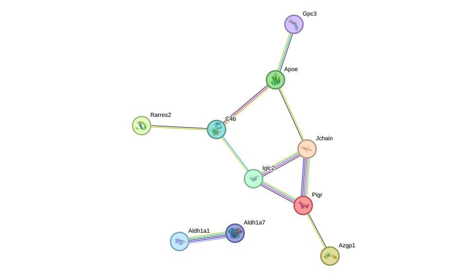
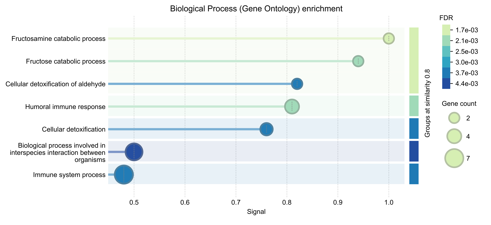
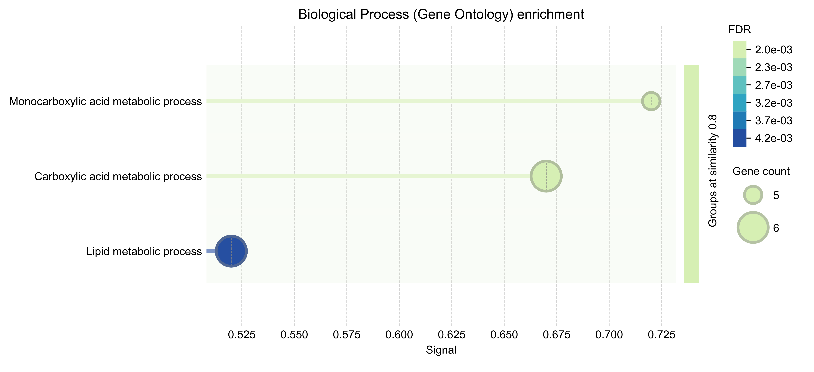

# Planteamiento

El análisis de expresión diferencial devuelve conjuntos de genes clasificados en tres categorías (UP, DOWN o no diferencialmente expresados) de acuerdo a sus niveles de expresión (_Log Fold Change_) y significancia estadística de acuerdo a contrastes entre condiciones [@anders-2010]. Con dichos resultados, se procede a anotar funcionalmente los genes encontrados, facilitando determinar las diferencias biológicas presentes en los conjuntos resultantes. Para ello, se emplean herramientas como **Gene Ontology (GO)**, que clasifica genes según funciones y procesos biológicos [@gaudet-2016]; **STRING**, que permite explorar redes de interacción proteína-proteína [@szklarczyk-2024]; **WGCNA**, útil para identificar módulos de genes coexpresados [@rezaie-2023]; y **GSEA**, que evalúa si conjuntos de genes asociados a rutas o funciones específicas están enriquecidos en una condición determinada [@fang-2022].

En este trabajó se realizó la anotación funcional con datos obtenidos por el alineamiento hecho con `STAR` y lecturas de tipo _paired-end_ (PE), mediante la herramienta **DAVID** [@sherman-2022], **STRING** [@szklarczyk-2024] y **GSEA** [@fang-2022].

# Metodología & Justificación

Por los insights obtenidos en el reporte previo a este, se optó por el dataset **STAR-PE** analizado con `DESeq2` bajo la implementación en Python (suite **inmoose** [@colange-2025]), con los siguientes umbrales para los genes diferencialmente expresados:

- $|LFC| > 0.5$,
- $FDR < 10^{-6}$, es decir, se aceptó un falso positivo por cada millón de genes.

## Librerías

Para este trabajo se empleó Python como lenguaje de programación principal mediante un ambiente virtual de `Conda`.

```{shell}
#| label: conda_env
#| echo: true
#| eval: false

conda activate mi_entorno

conda install bioconda::gseapy=1.2.1 \
              numpy=1.26.4 \
              pandas=2.2.3 \
              matplotlib=3.10.0 \
              seaborn=0.13.2
```

Posteriormente, se cargaron dichas librerías al entorno de Python:

```{python}
#| label: librerias_python
#| echo: true
#| eval: true
#| message: false
#| warning: false

# ================ LIBRERÍAS ================

from gseapy.plot import gseaplot2
import matplotlib.pyplot as plt
import seaborn as sns
import gseapy as gp
import pandas as pd
import numpy as np
```

## Genes diferencialmente expresados

Para comprender mejor los resultados se recuperaron los 5 genes más significativos tanto de los **UP** como **DOWN** dentro de la siguiente tabla:

```{python}
#| tbl-cap: "Funciones asociadas a cada gen de los 5 más significativos tanto UP como DOWN."
#| echo: false
#| eval: true
#| message: false

up = pd.read_csv(
  "results/star_pe/diffexp_Inmoose/inmoose-DEG-UP-1e-06.csv",
  sep = ",", header = 0, index_col = 0
).sort_values(by = "adj_pvalue", ascending = True)
down = pd.read_csv(
  "results/star_pe/diffexp_Inmoose/inmoose-DEG-DOWN-1e-06.csv",
  sep = ",", header = 0, index_col = 0
).sort_values(by = "adj_pvalue", ascending = True)

label = "Regulation"
up[label], down[label] = "UP", "DOWN"

subset = ["Gene_name", "Regulation"]
melted = pd.concat(
  [up[subset].head(5), down[subset].head(5)],
  axis = 0, ignore_index = True
)

melted
```

Para la descripción de sus funciones se consultó la base de datos `Gene` del _NCBI_ [@ncbi-2017].

### UP

- **C4b**: Participa en la activación del complemento y en la respuesta inmune mediada por inmunoglobulinas, contribuyendo a la eliminación de complejos inmunes o agentes extraños.

- **Igha**: Codifica una IgA que reconoce antígenos y contribuye a la inmunidad humoral y mucosal, especialmente en el intestino.

- **Pigr**: Este gen codifica el **receptor de inmunoglobulinas poliméricas**, encargado de transportar IgA hacia superficies mucosas y contribuir a la defensa inmunológica epitelial, especialmente en el intestino.

- **Ighg2b**: Codifica una IgG que reconoce antígenos y favorece la respuesta inmune humoral y la fagocitosis, ayudando al reconocimineto de agentes externos.

- **Iglv1**: Participa en la **respuesta inmune** y forma parte del **complejo de inmunoglobulinas**, probablemente como una región variable de cadena ligera lambda.

En líneas generales, se observó que estos genes participan principalmente en la respuesta inmune humoral y mucosal. Esto sugiere que, a los 18 meses, los ratones presentan una sobreexpresión de genes asociados con la síntesis de inmunoglobulinas, activación del complemento y defensa inmunológica del organismo.

### DOWN

- **Ctxn3**: Codifica una proteína de membrana, expresada en sistema genitourinario y otocisto, ortóloga de `CTXN3` humano.

- **Snx31**: Participa en el transporte intracelular y reciclaje endocítico de proteínas, mediante unión a fosfatidilinositol en complejos membranales.

- **Slc22a7**: Transporta alfa-cetoglutarato y prostaglandinas a través de la membrana, especialmente en la membrana apical del riñón en desarrollo.

- **Ugt2b38**: Participa en la glucuronidación y metabolismo de esteroides, principalmente en retículo endoplásmico.

- **Cyp2d26**: Participa en el metabolismo de araquidonato y xenobióticos, con actividad tipo citocromo P450 y unión a hemo.

En suma, estos genes DOWN se relacionan principalmente con transporte membranal, reciclaje endocítico y metabolismo de compuestos endógenos o xenobióticos. Esto sugiere que, a los 18 meses, los ratones presentan una menor expresión de genes asociados con funciones de transporte, detoxificación y metabolismo renal o epitelial.

## DAVID

```{shell}
#| label: listas_DAVID
#| echo: true
#| eval: true
#| message: false

#!/usr/bin/env bash
set -euo pipefail
shopt -s nullglob

# Directorio con los datos
INMOOSE_DIR="./results/star_pe/diffexp_Inmoose"

# Archivos de entrada y salida
files=(
  "inmoose-DEG-RAW_star.csv:inmoose-RAW-names.txt"
  "inmoose-DEG-UP-1e-06.csv:inmoose-UP-names.txt"
  "inmoose-DEG-DOWN-1e-06.csv:inmoose-DOWN-names.txt"
)

# ===================== GENES =====================
for item in "${files[@]}"; do
    IFS=":" read -r input output <<< "$item"

    input_file="${INMOOSE_DIR}/${input}"
    output_file="${INMOOSE_DIR}/${output}"

    # Extracción de la columna con los Ensembl_id
    cut -d"," -f1 "$input_file" | sed 1d > "$output_file"
done
```

Una vez que se extrajeron las listas de indentificadores génicos de *Ensembl* tanto **UP**, **DOWN** como todos los filtrados se procedió a su análisis con la herramienta [`DAVID`](https://davidbioinformatics.nih.gov/summary.jsp) [@sherman-2022] para la obtención de la anotación funcional disponible en la web.

Los genes filtrados, mas no clasificados, fueron utilizados como background para el análisis de enriquecimiento funcional. Por la naturaleza de la herramienta `DAVID`, se optó por efectuar cada uno por separado: primero los genes UP (ver **Figura 1**) y después DOWN (ver **Figura 2**).

```{python}
#| label: bubbleplot_funcion_datos
#| echo: false
#| eval: true
#| message: false
#| warning: false

# ===================== FUNCIONES =====================

def bubbleplot(
  data: pd.DataFrame,
  ax,
  ratio_col: str | None = None,
  term_col: str = "Term",
  count_col: str = "Count",
  padj_col: str = "FDR",
  top_n: int = 25,
  title: str | None = None,
  cmap: str = "viridis"
) -> None:

  data2plot = data.copy()

  # Reescalando el p-adj
  data2plot[padj_col] = (
    data2plot[padj_col]
    .replace(0, np.nextafter(0, 1))
  )
  data2plot["-log10(FDR)"] = -np.log10(data2plot[padj_col])

  # Selección de los términos más significativos
  data2plot = (
    data2plot.sort_values(padj_col)
    .head(top_n)
    .copy()
  )

  # Ordenar términos para que el más significativo quede arriba
  data2plot[term_col] = pd.Categorical(
    data2plot[term_col],
    categories=data2plot[term_col][::-1],
    ordered=True
  )

  if ratio_col is None:
    ratio_col = "Gene Ratio"
    data2plot[ratio_col] = data2plot[count_col] / data2plot["List Total"]

  elif ratio_col == "Fold Enrichment":
    data2plot["Fold Enrichment / max(Fold Enrichment)"] = (
      data2plot[ratio_col] / data[ratio_col].max()
    )
    ratio_col = "Fold Enrichment / max(Fold Enrichment)"

  sns.scatterplot(
    data=data2plot,
    x=ratio_col,
    y=term_col,
    size=count_col,
    hue="-log10(FDR)",
    sizes=(80, 600),
    palette=cmap,
    edgecolor="black",
    linewidth=0.4,
    alpha=0.85,
    ax=ax
  )

  ax.set_title(title, fontweight="bold")
  ax.set_xlabel(ratio_col)
  ax.set_ylabel("")
  ax.grid(axis="x", linestyle="--", alpha=0.3)

  sns.despine(ax=ax, left=True)

  return ax


# ===================== DATOS =====================

up = pd.read_csv(
  "results/star_pe/annotation_Inmoose/UP_KIDNEY.txt",
  sep="\t", header=0, index_col=0
)

down = pd.read_csv(
  "results/star_pe/annotation_Inmoose/DOWN_KIDNEY.txt",
  sep="\t", header=0, index_col=0
)

# Limpiando los términos
for data in (up, down):
  data["Term"] = (
    data["Term"].str
    .replace(r"^.*[:~]", "", regex=True)
    .str.strip()
  )

  data.index.name = None
```

```{python}
#| label: bubbleplot_david_up
#| fig-cap: "Bubbleplot de las funciones biológicas, componentes celulares y rutas bioquímicas obtenidas mediante DAVID para los genes UP. El color representa -log10(FDR), el tamaño de la burbuja indica el número de genes asociados al término y el eje x muestra el enriquecimiento relativo normalizado."
#| echo: false
#| eval: true
#| message: false
#| warning: false
#| fig-width: 10
#| fig-height: 7
#| fig-align: center
#| out-width: "100%"

plt.close("all")

fig, ax = plt.subplots(figsize=(10, 7))

bubbleplot(
  up,
  ax=ax,
  top_n=15,
  title="UP",
  ratio_col="Fold Enrichment"
)

handles, labels = ax.get_legend_handles_labels()

legend = ax.get_legend()
if legend is not None:
    legend.remove()

fig.legend(
    handles,
    labels,
    title="Labels",
    loc="center right",
    bbox_to_anchor=(1.02, 0.5),
    frameon=False
)

fig.subplots_adjust(
    left=0.38,
    right=0.78,
    bottom=0.13,
    top=0.90
)

plt.show()
```

```{python}
#| label: bubbleplot_david_down
#| fig-cap: "Bubbleplot de las funciones biológicas, componentes celulares y rutas bioquímicas obtenidas mediante DAVID para los genes DOWN. El color representa -log10(FDR), el tamaño de la burbuja indica el número de genes asociados al término y el eje x muestra el enriquecimiento relativo normalizado."
#| echo: false
#| eval: true
#| message: false
#| warning: false
#| fig-width: 10
#| fig-height: 7
#| fig-align: center
#| out-width: "100%"

plt.close("all")

fig, ax = plt.subplots(figsize=(10, 7))

bubbleplot(
  down,
  ax=ax,
  top_n=15,
  title="DOWN",
  ratio_col="Fold Enrichment"
)

handles, labels = ax.get_legend_handles_labels()

legend = ax.get_legend()
if legend is not None:
    legend.remove()

fig.legend(
    handles,
    labels,
    title="Labels",
    loc="center right",
    bbox_to_anchor=(1.02, 0.5),
    frameon=False
)

fig.subplots_adjust(
    left=0.38,
    right=0.78,
    bottom=0.13,
    top=0.90
)

plt.show()
```

## STRING

Como entrada para `STRING`, se recuperaron los identificadores génicos de *Ensembl* para cada clasificación (UP y DOWN). En la [interfaz gráfica](https://string-db.org) de la herramienta se dejaron los parámetros default para la inferencia de la red, recuperando únicamente la representación de la red (ver **Figuras 2** y **3**) y el enriquecimiento funcional por proceso biológico.

### Genes UP



La red de STRING (ver **Figura 3**) muestra que los genes sobreexpresados forman un módulo funcional asociado principalmente con la **respuesta inmune humoral y mucosal**. Se observa una conexión entre genes relacionados con inmunoglobulinas y transporte de anticuerpos, como `Iglc2`, `Jchain` y `Pigr`, junto con `C4b`, vinculado con la activación del complemento. Esto sugiere que, a los 18 meses, se presenta una mayor coordinación funcional entre proteínas involucradas en defensa inmunológica, reconocimiento de antígenos y respuesta mediada por inmunoglobulinas.



### Genes DOWN


En la **Figura 5** se mostró que los genes **DOWN** exhiben asociaciones funcionales relacionadas principalmente con **transporte membranal, metabolismo de xenobióticos y procesos de detoxificación**. Se observa un grupo de genes conectados como `Cyp2d26`, `Ugt2b38`, `Mpv17l`, `Crot` y `Slc22a19`, vinculados con metabolismo intracelular y procesamiento de compuestos endógenos o externos. Además, genes como `Slc22a7` y `Slco1a6` sugieren una disminución en funciones de transporte, particularmente relevantes para tejidos epiteliales o renales. A grandes rasgos, la red sugiere que, a los 18 meses, se reduce la expresión coordinada de genes asociados con transporte, metabolismo y detoxificación.



## GSEA

En esta sección se utilizó la implementación de `GSEApy`, el cual es un método computacional que determina si un conjunto de genes definidos previamente muestra diferencias concordantes y estadísticamente significativas entre dos fenotipos (también denominados _estados biológicos_) [@fang-2022].

Como entrada se recuperó la salida de `DESeq2` (implementación de `inmoose`) [@colange-2025] y se siguió el procedimiento descrito en [@unknown-author-2022]. Asimismo, `GSEA preranked` se utilizó una lista ordenada de genes con base en el **estadístico de Wald** (stat), ya que este incorpora tanto la dirección del cambio de expresión como la incertidumbre asociada a la estimación. Además, se ajustaron los parámetros `min_size` y `max_size` para restringir el análisis a conjuntos génicos con un tamaño suficientemente informativo, evitando términos demasiado pequeños o excesivamente generales. Finalmente, se tomaron las bases de datos de `KEGG_2019_Mouse` [@fabris-2016] y `GO_Cellular_Component_2026` [@gaudet-2016] para el enriquecimiento.

```{python}
#| label: geseapy
#| echo: true
#| eval: true
#| message: false
#| warning: false
#| fig-align: center
#| out-width: "100%"

# ================ CARGANDO DATOS ================

data = pd.read_csv(
  "results/star_pe/diffexp_Inmoose/inmoose-DEG-RAW_star.csv",
  sep = ",", header = 0
)

# Retiro de genes sin nombre, LFC o p ajustado
data = data.dropna(
    subset=["Gene_name", "log2FoldChange", "adj_pvalue"]
)

# Generando el ranking y ordenando acorde a este valor
data["Rank"] = data.stat

ranking = (
  data[["Gene_name", "Rank"]]
  .assign(Gene_name = lambda x: x["Gene_name"].str.upper())
  .drop_duplicates("Gene_name")
  .sort_values("Rank", ascending = False)
)

# ================ BIOLOGICAL PROCESS ================

pre_res = gp.prerank(
  rnk = ranking, 
  organism = "Mus musculus",
  gene_sets = ["GO_Cellular_Component_2026", "KEGG_2019_Mouse"],
  seed = 42, # Reproducibilidad
  # min y max_size solicitan a la función:
  # evalúa solo gene sets que tengan entre 5 y 1000 
  # genes presentes en tu ranking
  min_size = 5,
  max_size = 1000,
  permutation_num = 1000
)

# Resultados
out_results = pre_res.res2d.sort_values(
  by = "FDR q-val", ascending = True
)
out_results.to_csv(
  "results/star_pe/annotation_Inmoose/gseapy_results.csv",
  sep = ",", index = False
)
```

```{python}
#| label: gsea-fig
#| fig-cap: "Gráfico del enriquecimiento funcional en Procesos Biológicos (BP) de GO y rutas de KEGG, recuperando los 8 términos más significativos de acuerdo al FDR. Dado que este análisis utilizó como ranking el estadístico de Wald (stat), valores negativos refieren a un enriquecimiento en los ratones con 3 meses de edad mientras que valores positivos se asocian con ratones de 18 meses."
#| echo: false
#| eval: true
#| message: false

plt.close("all")

# Mostrar los 5 BPs más significativos
terms = out_results.Term[0:8]
hits = [pre_res.results[t]["hits"] for t in terms]
runes = [pre_res.results[t]["RES"] for t in terms]

fig = gseaplot2(
  terms = terms, 
  RESs = runes, 
  hits = hits,
  rank_metric = pre_res.ranking,
  # set the legend loc
  legend_kws = {'loc': (-0.5, 1.07)},
  figsize = (4,5)
)

plt.tight_layout()
plt.show()

del fig, terms, hits, runes, out_results, pre_res
```

La **Figura 7** señaló que términos como Leishmaniasis, degradación de valina, leucina e isoleucina y señalización NF-κB presentan enriquecimiento positivo, por lo que sus genes tienden a concentrarse hacia el extremo superior del ranking. En contraste, términos como matriz mitocondrial, membrana mitocondrial, subunidad ribosomal grande y procesamiento de proteínas en retículo endoplásmico muestran enriquecimiento negativo, indicando que sus genes se acumulan hacia el extremo inferior. En general, esto sugiere una separación funcional entre **procesos inmunes/inflamatorios más asociados al extremo positivo** (ratones con 18 meses de edad) y **procesos mitocondriales, ribosomales y metabólicos asociados al extremo negativo** (ratones con 3 meses de edad).

# Discusión

En líneas generales, los resultados sugieren que el envejecimiento se asocia con una reorganización funcional clara entre genes inmunes y genes metabólicos. Los genes **UP** muestran un patrón dominado por funciones de respuesta inmune humoral y mucosal, incluyendo síntesis de inmunoglobulinas, transporte de IgA mediante `Pigr` y activación del complemento por `C4b`. Esto coincide con la red de `STRING`, donde se observa una agrupación funcional de genes relacionados con inmunoglobulinas, complemento y reconocimiento antigénico, lo que sugiere una mayor actividad inmunológica en los ratones de 18 meses.

Por el contrario, los genes **DOWN** se relacionan principalmente con transporte membranal, metabolismo de xenobióticos, detoxificación y funciones mitocondriales o peroxisomales. La red de `STRING` respalda esta interpretación al mostrar asociaciones entre genes como `Cyp2d26`, `Ugt2b38`, `Slc22a7`, `Slco1a6` y otros vinculados con transporte y metabolismo celular. Esto sugiere que, en los ratones de 18 meses, existe una menor expresión coordinada de genes asociados con metabolismo epitelial o renal, transporte de compuestos y procesamiento de moléculas tanto propias como externas.

Finalmente, el análisis `GSEA` complementa estos hallazgos al mostrar enriquecimiento positivo de términos asociados con procesos inmunes e inflamatorios, como señalización por **NF-κB**, mientras que los términos con enriquecimiento negativo se relacionan con matriz y membrana mitocondrial, peroxisoma, subunidades ribosomales y procesamiento proteico. En suma, estos resultados apuntan a una transición funcional en la edad avanzada, caracterizada por mayor activación inmune y una posible disminución relativa de procesos metabólicos, mitocondriales y de detoxificación.

# Conclusiones

**CONCLUSIÓN**

La anotación funcional permitió interpretar biológicamente los resultados de expresión diferencial, mostrando que los genes sobreexpresados en ratones de 18 meses se asocian principalmente con respuesta inmune humoral, inmunoglobulinas, complemento e inflamación, mientras que los genes con menor expresión se relacionan con transporte membranal, metabolismo, detoxificación y funciones mitocondriales o peroxisomales. Estos hallazgos son especialmente relevantes al tratarse de tejido renal, ya que el riñón es un órgano sensible al envejecimiento y refleja cambios asociados con disfunción mitocondrial, alteraciones metabólicas, transporte epitelial e infiltración inmunitaria [@schaum-2020].

Además, al comparar las salidas de `DAVID`, `STRING` y `GSEA`, se observó que estas herramientas no necesariamente producen resultados solapados, sino **complementarios**: `DAVID` permitió identificar funciones enriquecidas en listas específicas de genes, `STRING` evidenció módulos de interacción funcional y `GSEA` mostró tendencias globales a lo largo del ranking génico. Esto fortaleció la interpretación de que el envejecimiento renal se acompaña de una mayor activación inmune y una disminución relativa de procesos metabólicos, mitocondriales, de detoxificación y de transporte.

Dicha complementariedad dejó patente que se requiere examinar más de una herramienta para obtener interpretaciones más concluyentes y detalladas sobre los procesos biológicos evaluados mediante flujos de trabajo bioinformáticos como el del presente trabajo.

# Referencias